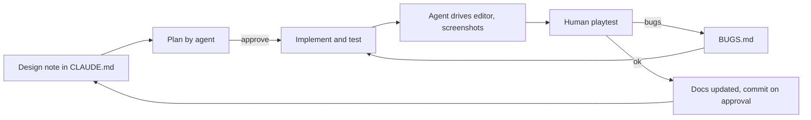

# 01 Case study: from hand-made games to agent-driven development

Game: **VOX VEGETALLIS**, a roguelike arcade bullet hell where a candy gladiator fights food combatants in a vegetable colosseum
(Unity 6.3, 2D URP, new Input System, PS5 DualSense first). This document is the narrative; the other files are the evidence.
Statements I could not confirm from the repository are marked [VERIFY]; the author's own words go in `10_Reflections.md`.

## 1. The story in one page
I used to build games by hand, with an AI assistant helping on scripts. For this project I switched to agent-driven development with Claude Code:
the agent writes most of the code, builds editor tooling, drives the Unity Editor and keeps the docs; I write the design, paint the art, playtest
and decide. The goal was to build and learn faster, using arcade-style games as the test case because they are small, tunable and
judged by feel.

Result so far (numbers in `09_Metrics.md`): in three days of git history (2026-09-28 to 2026-09-30, 50 commits) the project went from an empty Unity
project to a playable vertical slice: movement and a two-stick arm system, ammo and heat, armaments, a card shop and armory, seven authored rounds,
flow-field enemy AI, a fake-height jump, a multi-phase boss, a save system, a full themed UI, and performance tooling.

## 2. Workflow summary
1. **Write the spec first.** `CLAUDE.md` describes the game, rules and milestones. Design notes are committed before the code (`07_AgenticWorkflow.md`).
2. **One milestone per session, plan first.** The agent proposes a plan, I approve, it implements.
3. **Agent verifies.** It compiles, runs the tests, drives the editor through the `unity` CLI, takes screenshots and reports what to playtest.
4. **I playtest and judge.** Feel, scale, readability and art are my calls; bugs go to `Docs/BUGS.md`.
5. **Docs stay alive.** The agent updates CLAUDE.md, the art docs, the bug list and (from PF1) this case study at the end of each milestone.
6. **Approval gates.** No commits or pushes without asking.

## 3. What was built, in order
Skeleton and input (M0 to M1.5), firing and ammo (M2, M3a), armaments (M3b), game flow and saves (M4), combat and waves (M5a/b), front end (M6), arena
(M7), perspective, jump and arm ring (M7.5 to M7.7), enemy AI (M8), height classes and layouts (M8.5), animation toolkit (M8.6), art scale test and lock,
UI theme and paper-doll characters, armament behaviors, shop and armory (M9a to M9d), the Pumpking boss (M10), performance tooling (P1), the VOX VEGETALLIS UI (UI2).
Dated detail: `05_DevLog.md`.

## 4. Pros of agentic development for arcade-style games
- **Speed on structure.** Systems with many small pieces (data assets, pooled projectiles, state machines, editor setup scripts) come out consistent because the rules live in CLAUDE.md.
- **Data-driven by default.** "All tunable numbers in ScriptableObjects" is easy to enforce with an agent and is exactly what arcade balancing needs.
- **Tooling on demand.** The agent writes one-off editor tools (setup scripts, theme builder, screenshot renderer) that would not be worth hand-writing.
- **Verification loop.** It can run tests, play the flow through the editor and look at screenshots, so it finds many of its own mistakes.
- **Docs as a by-product.** Specs, bug reports and this case study are cheap to keep current.
- **Learning by review.** Reading plans and diffs can teach architecture faster than writing everything alone [VERIFY: the author's view, see reflections].

## 5. Cons and risks
- **Feel is not automatable.** Jump weight, bullet readability, UI polish and scale needed human eyes and repeated rounds.
- **Silent drift.** Old setup scripts still build the old look; two generations of code coexist until cleaned up.
- **Fragile tooling.** The editor only ticks frames when focused, scripted regex edits can corrupt files (the `CLAUDE.md` incident), and domain reloads interrupt long runs.
- **Context limits.** Big cross-cutting changes (Text to TextMeshPro touched 44 files) need a staged plan with a record file between phases.
- **Over-eagerness.** Without written rules an agent may commit, refactor unrelated code or fix unrelated bugs; the working agreement exists to stop that.
- **Test debt.** Edit-mode tests that depend on live services fail (11 open), which shows how easily green tests erode.

## 6. Lessons
1. The spec is the product: anything not in CLAUDE.md gets re-invented.
2. Keep milestones small enough to review in one sitting.
3. Put every gameplay number in data; the agent should never hard-code feel.
4. Make the agent prove it: compile, test, screenshot, then report.
5. Log bugs instead of silently fixing them; keep a "not caused by this change" list.
6. Keep destructive or outward-facing actions behind explicit approval, and treat a blocked action as a signal to stop and ask.
7. Human judgment is irreplaceable for art direction, scale and feel (`07_AgenticWorkflow.md`, section 5).

## 7. Where to read more
`02_Architecture.md`, `03_GameFlow.md`, `04_Systems/`, `05_DevLog.md`, `06_Roadmap.md`, `07_AgenticWorkflow.md`, `08_ArtPipeline.md`, `09_Metrics.md`, `10_Reflections.md` (template for my own words).
