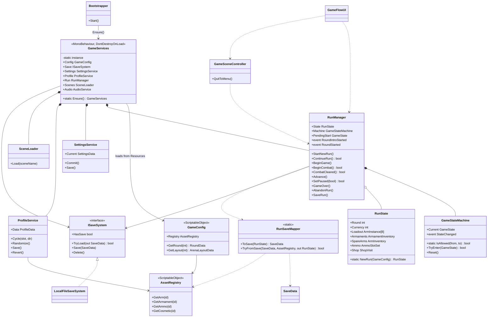
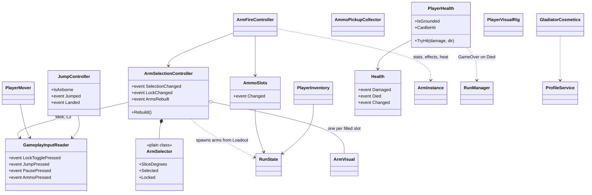
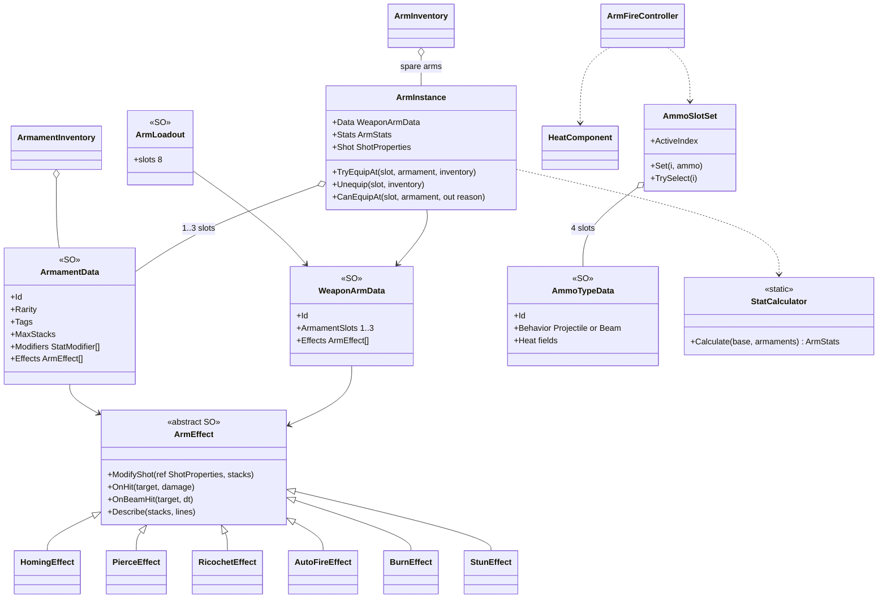
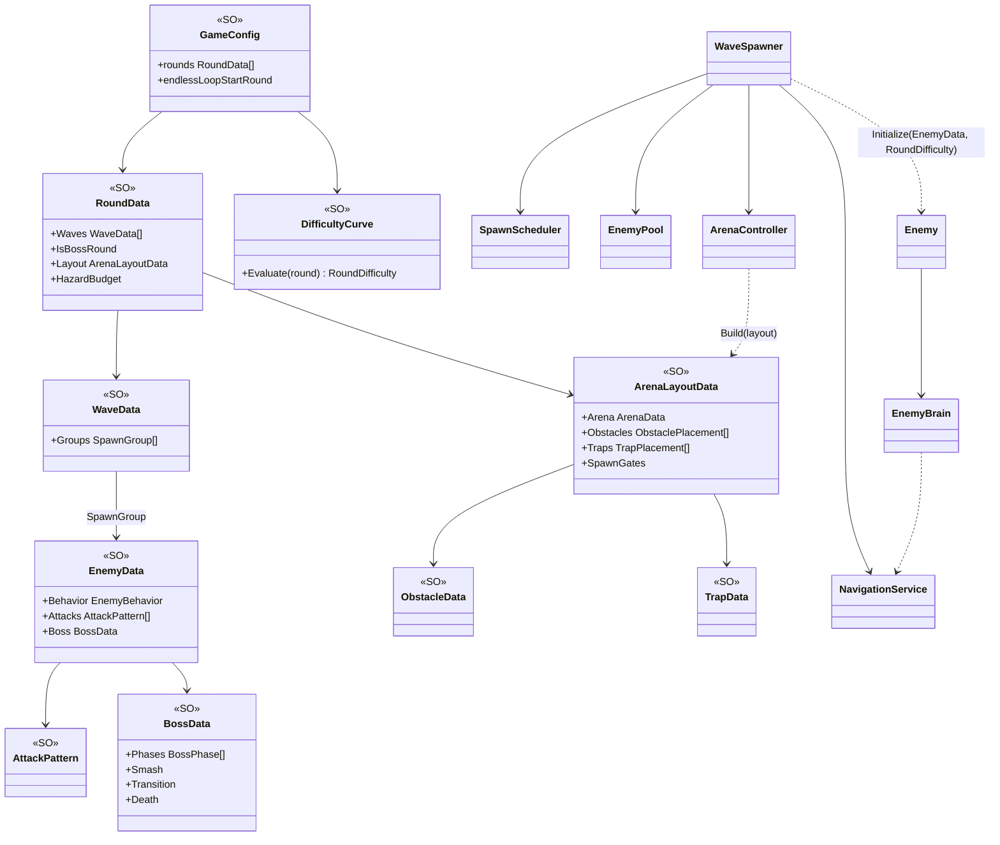
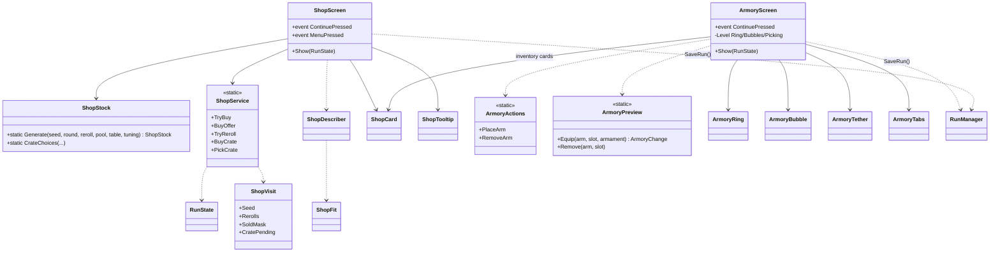
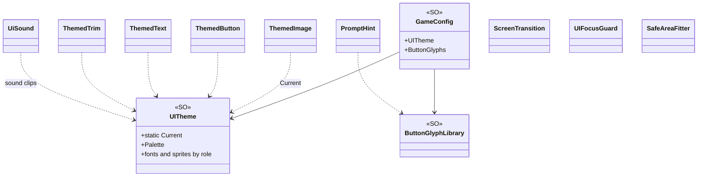
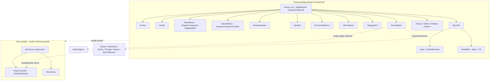

# 02 - Architecture

Unity 6.3 LTS (6000.3), 2D URP, new Input System. Roguelike arcade bullet hell: a candy gladiator in a vegetable colosseum.
This document describes how the code and data are organised. Everything below was read from the repository
(`C:\Dev\BulletHell`). Anything inferred rather than confirmed in code is marked **[VERIFY]**.

## 1. Layers and folders

The project is split into four layers. Code depends downward only (UI -> gameplay -> core/data); the data layer is plain
ScriptableObject assets that the code only reads.

| Layer | Folders (under `Assets/Scripts/`) | Role |
|---|---|---|
| Core / services | `Core`, `Save`, `Settings`, `Platform`, `Input`, `Perf` | Persistent services (`GameServices`), run flow (`RunManager`, `GameStateMachine`, `RunState`), save/settings/profile I/O, input readers, `GameClock`, dev performance tools |
| Gameplay | `Player`, `Weapons`, `Projectiles`, `Enemies`, `AI`, `Bosses`, `Arena`, `Pickups`, `Feedback`, `Cosmetics` | Player, arms/ammo/armaments, pooled bullets, enemies and their AI, bosses, arena/traps/obstacles, coins and ammo pickups, procedural motion and VFX |
| Meta / screens | `Shop`, `Armory` | Shop stock generation and buying, Armory equip flow |
| UI | `UI` | HUD, menus, settings/customization screens, themed widgets (`UITheme`), banners, dialogs |
| Data | `Assets/Data/*`, `Assets/Resources/GameConfig.asset` | ScriptableObject instances (see section 2) |

Other top-level folders: `Assets/Prefabs` (Player, Enemy, Boss variant, Arm, Projectile, Obstacle, Trap, Coin, AmmoPickup,
GladiatorDoll, `UI/`, `Vfx/`), `Assets/Scenes` (Boot, MainMenu, Game, RigTest), `Assets/Editor` (setup/builder scripts such as
`M10Setup.cs`, `UiBuilder.cs`, `Vox*.cs`), `Assets/Tests/EditMode` (NUnit edit-mode tests), `Assets/Art`, `Assets/UI`,
`Docs/` and `ArtSource/` (outside `Assets`).

Design rules that shape the structure (from `CLAUDE.md`):
- All tunable numbers live in ScriptableObjects; MonoBehaviours read them.
- All projectiles and most spawned things use `UnityEngine.Pool.ObjectPool<T>` (`ProjectilePool`, `EnemyPool`, `CoinField`, and the obstacle/trap pools in `ArenaController`).
- One run flow through a single `GameStateMachine`.
- Systems talk through C# events, not scene searches.
- Input goes only through the generated `GameInput` class (`Assets/Data/Input/GameInput.inputactions`, generated `Assets/Scripts/Input/GameInput.cs`).
- Gameplay stays on the flat XY plane; "height" (jump, bullet lift) is visual only.

## 2. ScriptableObject catalogue

Found with `Grep ':\s*ScriptableObject'` over `Assets/Scripts`: 38 classes (37 concrete, plus the abstract `ArmEffect`).
Instance counts come from scanning `.asset` files for each script's GUID (142 asset instances in total).

| Class | File | What it holds (key fields) | Instances live in | Count |
|---|---|---|---|---|
| `GameConfig` | `Core/GameConfig.cs` | `registry`, file names (`run_save.json`, `settings.json`, `profile.json`), `settingsDefaults`, `newRunLoadout`, `startingAmmo[4]`, test stock (`startingArmaments`, `startingSpareArms`), `startingCurrency`, `shopPool`, `rarityTable`, `shopTuning`, `rounds[]`, `endlessLoopStartRound`, `difficulty`, `defaultLayout`, `perspective`, `arenaArt`, `uiTheme`, `buttonGlyphs`, `enemyBulletPalette`, `feedback`, `debugStartRound` | `Assets/Resources/GameConfig.asset` | 1 |
| `AssetRegistry` | `Save/AssetRegistry.cs` | arrays of `WeaponArmData`, `ArmamentData`, `AmmoTypeData`, `CosmeticPartData`; `partLibrary` (Sprite Library); id -> asset lookups | `Assets/Data/AssetRegistry.asset` | 1 |
| `SettingsDefaults` | `Settings/SettingsDefaults.cs` | default volumes, toggles, aim sensitivity (+ min/max/step), volume step | `Data/Settings` | 1 |
| `InputTuning` | `Input/InputTuning.cs` | `selectThreshold` 0.85, `deselectThreshold` 0.65, `angleHysteresisDegrees` 8, `lockedAimDeadzone` | `Data/Input` | 1 |
| `PlayerData` | `Player/PlayerData.cs` | `moveSpeed`, `armRingRadius`, `bodyRadius`, `bodyCenterHeight`, `maxHealth` (5), `hitboxRadius`, `coreFootOffset`, `invulnerabilitySeconds`, `blinkInterval` | `Data/Player` | 1 |
| `JumpTuning` | `Player/JumpTuning.cs` | `airtime`, `maxHeight`, `heightCurve`, `cooldownAfterLanding`, `airControl`, `lowClearHeight`, `jumpDodgesBullets`, squash/scale/shadow/dust values | `Data/Player`, `Data/Bosses` (`Jump_Pumpking`) | 2 |
| `ArmRingTuning` | `Player/ArmRingTuning.cs` | `radiusX`, `radiusYRatio` (0.6), `verticalOffset`, spin speed, front/back sort orders, soft/locked outline widths and alphas, depth-cue scales | `Data/Player` | 1 |
| `WeaponArmData` | `Weapons/WeaponArmData.cs` | `id`, `displayName`, `idColor`, `sprite`, `artRotation`, `muzzleOffset`, `damage`, `fireRate`, `projectileSpeed`, `projectilesPerShot`, `spread`, `projectileSize`, built-in `effects[]`, `armamentSlots` (1-3), `rarity`, `priceTier` | `Data/Arms` (Red, Blue, Green, Purple, Ember, Piercer) | 6 |
| `ArmamentData` | `Weapons/ArmamentData.cs` | `id`, `displayName`, `icon`, `rarity`, `priceTier`, `tags`, `maxStacks`, `modifiers[]` (`StatModifier`: stat + Flat/Percent), `effects[]` | `Data/Armaments` | 10 |
| `AmmoTypeData` | `Weapons/AmmoTypeData.cs` | `id`, sprites/icon/tint, `behavior` (Projectile/Beam), multipliers (damage, rate, speed, size), `extraProjectiles`, spread, beam range/width, heat (`usesHeat`, `heatPerShot`, `heatPerSecond`, `coolPerSecond`, `restartThreshold`), spin-up | `Data/Ammo` (Basic, Shotgun, Laser, Gatling, TestSpare) | 5 |
| `ArmEffect` (abstract) | `Weapons/ArmEffect.cs` | `displayName`; hooks `ModifyShot`, `OnHit`, `OnBeamHit`, `Describe`. Concrete subclasses in `Weapons/Effects/`: `AutoFireEffect`, `BurnEffect`, `HomingEffect`, `PierceEffect`, `RicochetEffect`, `StunEffect` | `Data/Effects` | 6 |
| `ArmLoadout` | `Weapons/ArmLoadout.cs` | `slots[8]` of `WeaponArmData` (N, NE, E, SE, S, SW, W, NW) | `Data/Loadouts` (StartingLoadout, DebugLoadout) | 2 |
| `PickupTuning` | `Pickups/PickupTuning.cs` | pickup/prompt radius, `holdDuration` 0.75, drop distance/immunity, visual size | `Data/Pickups` | 1 |
| `CoinTuning` | `Pickups/CoinTuning.cs` | magnet radius/speeds, collect radius, pop, size, colour, pool prewarm/max | `Data/Pickups` | 1 |
| `EnemyData` | `Enemies/EnemyData.cs` | identity/colour/size, `paintedSprite` + footprint/hurtbox, `maxHealth`, `coinValue`, `attacks[]` (`AttackPattern`), `behavior` (Patrol/Chaser/Skirmisher/Sentry/Charger/Sniper/Boss), movement (speed, acceleration, brake, turn rate), contact damage, per-archetype blocks (skirmisher, sentry heat, charger, sniper), feedback overrides, `boss` (`BossData`) | `Data/Enemies` | 12 |
| `AttackPattern` | `Enemies/AttackPattern.cs` | `shape`, `bulletCount`, `spreadAngle`, `spiralStep`, `fireInterval`, `initialDelay`, bullet speed/size/damage/lifetime, `bulletStyle` | `Data/Enemies/Patterns` | 10 |
| `EnemyBulletPalette` | `Enemies/EnemyBulletPalette.cs` | Standard/Special `Look` (core, body, outline), outline/core/glow sizes, reserved hue range | `Data/Enemies` | 1 |
| `EnemyAiTuning` | `AI/EnemyAiTuning.cs` | `navRadius`, flow-field rebuild interval, separation padding/weight, turn slowdown, warning line, LOS radius | `Data/Enemies` | 1 |
| `CombatTuning` | `Enemies/CombatTuning.cs` | spawn margins and ring radius, banner seconds, round intro seconds and countdown steps, enemy/boss pool sizes | `Data/Waves` | 1 |
| `DifficultyCurve` | `Enemies/DifficultyCurve.cs` | per-round `Axis` curves: enemy count, health, fire rate, bullet speed, move speed; `Evaluate(round)` -> `RoundDifficulty` | `Data/Waves` | 1 |
| `WaveData` | `Enemies/WaveData.cs` | `groups[]` of `SpawnGroup` (enemy, count, `SpawnPattern`, delay, interval) | `Data/Waves` | 22 |
| `RoundData` | `Enemies/RoundData.cs` | `waves[]`, `isBossRound`, `layout` (`ArenaLayoutData`), `hazardBudget`, `waveBreatherSeconds` | `Data/Waves/Rounds` | 7 |
| `BossData` | `Bosses/BossData.cs` | name, `maxHealth` 420, settle time, distance band, `phases[]` (`BossPhase`: HP threshold, speed multiplier, `BossAttack[]`, glow), `jumpTuning`, `SmashSettings`, `TransitionSettings`, `DeathSettings` | `Data/Bosses` (Boss_Pumpking) | 1 |
| `ArenaData` | `Arena/ArenaData.cs` | arena `size`, floor/wall/stands colours | `Data/Arenas` | 1 |
| `ArenaLayoutData` | `Arena/ArenaLayoutData.cs` | `arena`, `playerSpawn`, `spawnGates[]`, `ObstaclePlacement[]`, `TrapPlacement[]` | `Data/Arenas/Layouts` (R1-R7) | 7 |
| `ObstacleData` | `Arena/ObstacleData.cs` | `kind` (Solid/Breakable), `shape`, `heightClass` (Low/Tall), size, sprite, health, damage-stage tints, debris | `Data/Arenas/Obstacles` | 5 |
| `TrapData` | `Arena/TrapData.cs` | `kind`, size, damage to player/enemies, who it hurts, start delay, telegraph/active/cooldown seconds, hit interval, colours | `Data/Arenas/Traps` | 3 |
| `PerspectiveTuning` | `Arena/PerspectiveTuning.cs` | bullet allowance over obstacles, tall-fade alpha/seconds, enemy footprint/hurtbox, shadow look, bullet visual lift and shadow | `Data/Arenas` | 1 |
| `ArenaArt` | `Arena/ArenaArt.cs` | painted `backdrop`, crop rect, position, sorting order | `Data/Settings` | 1 |
| `FeedbackTuning` | `Feedback/FeedbackTuning.cs` | danger/flash colours, hitstop scale, shake params, per-role tuning references (player/enemy motion, hit, life-cycle), particle presets and pool sizes | `Data/Feedback` | 1 |
| `MotionTuning` | `Feedback/MotionTuning.cs` | breathing, hop, tilt, lean, squash/stretch spring, facing flip, windup inflate/tremble/pulse | `Data/Feedback` | 3 |
| `HitFeedbackTuning` | `Feedback/HitFeedbackTuning.cs` | flash seconds, knockback, scale punch, hitstop, shake, sparks | `Data/Feedback` | 3 |
| `LifeCycleTuning` | `Feedback/LifeCycleTuning.cs` | spawn pop curve/seconds, death squash/dissolve, splat particles | `Data/Feedback` | 2 |
| `CosmeticPartData` | `Cosmetics/CosmeticPartData.cs` | `id`, `slot` (Body/Armor/Head/Accessory1/Accessory2), `displayName`, `label` (Sprite Library entry) | `Data/Cosmetics` | 15 |
| `ShopPool` | `Shop/ShopPool.cs` | `arms[]`, `armaments[]`, `entries[]` (`ShopEntry`) | `Data/Shop` | 1 |
| `RarityTable` | `Shop/RarityTable.cs` | per-rarity `RarityEntry` (colour, base weight, weight per round, first round, price multiplier), `tierBasePrice[5]`, `priceGrowthPerRound`, `priceRounding` | `Data/Shop` | 1 |
| `ShopTuning` | `Shop/ShopTuning.cs` | arm/armament card counts (2/3), crate rarity/tier/choices, reroll base/step cost, debug currency grant | `Data/Shop` | 1 |
| `UITheme` | `UI/UITheme.cs` | `pixelScale`, `Palette`, rarity colours, TMP fonts, panel/pill/button/tab/trim/card sprites, SOLD stamp, sound clips; static `UITheme.Current` | `Data/UI` (VoxVegetallis) | 1 |
| `ButtonGlyphLibrary` | `UI/ButtonGlyphLibrary.cs` | `FamilySet[]` (PlayStation / Xbox / Nintendo / Touch / Keyboard) of glyph text and sprites per face button | `Data/UI` (ButtonGlyphs) | 1 |

Notes:
- `GameServices.cs` also matches the grep, but only through `ScriptableObject.CreateInstance<SettingsDefaults>()`; it is a `MonoBehaviour`.
- `Assets/Data/Cosmetics/GladiatorParts.asset` is a Unity Sprite Library asset, not one of the project's ScriptableObject types.
- Several "Tuning" classes expose a static `Fallback` (for example `PerspectiveTuning.Fallback`, `EnemyBulletPalette.Fallback`, `ArmRingTuning.Fallback`, `EnemyAiTuning.Fallback`) so a missing reference never crashes a scene.

## 3. Design data vs runtime state

The central rule: **ScriptableObject assets are read-only at runtime.** Run state lives on plain C# instances that point at assets.

| Design data (asset, shared, immutable in play) | Runtime instance (plain class, per run / per object) |
|---|---|
| `WeaponArmData` | `ArmInstance` (`Weapons/ArmInstance.cs`): the arm type + up to 3 equipped `ArmamentData`, cached `Stats` (`ArmStats`), `Effects`, `Shot` (`ShotProperties`), `Version`, `Changed` event |
| `ArmamentData` | held in `ArmamentInventory` (`Weapons/ArmamentInventory.cs`) or in an `ArmInstance` slot |
| `ArmLoadout` | only a template: `RunState.NewRun(config)` converts it into `ArmInstance[8]` |
| `AmmoTypeData` | `AmmoSlotSet` (4 slots + active index), owned by `RunState`, driven by the `AmmoSlots` component |
| `AmmoTypeData` heat fields | `HeatComponent` state per arm slot (inside `ArmFireController`) |
| `EnemyData` + `DifficultyCurve` | `Enemy` (pooled MonoBehaviour) bound via `Enemy.Initialize(...)` with a `RoundDifficulty`; `EnemyAgent` is the per-enemy plain object behaviours work with |
| `BossData` | `BossController` state (phase index, transition/death timers) |
| `ShopPool`/`RarityTable`/`ShopTuning` | `ShopVisit` (`Seed`, `Rerolls`, `SoldMask`, `CratePending`); stock is regenerated from `(Seed, round, Rerolls)` by `ShopStock.Generate` and never stored |
| `SettingsDefaults` | `SettingsData` (mutable, in `SettingsService.Current`) |
| `CosmeticPartData` | `ProfileData.cosmetics` (IDs) edited through `ProfileService` |
| `RoundData`/`ArenaLayoutData` | `ArenaController` builds pooled `Obstacle` / `Trap` objects; obstacle HP etc. live on those instances |

`RunState` (`Core/RunState.cs`) is the one owner of run data: `Round`, `Currency`, `Loadout` (8 `ArmInstance` slots), `Armaments`
(`ArmamentInventory`), `SpareArms` (`ArmInventory`), `Ammo` (`AmmoSlotSet`), and `Shop` (`ShopVisit`). `RunManager` holds the current
`RunState`; live objects (`PlayerInventory`, `AmmoSlots`, `ArmSelectionController`, Shop and Armory screens) read and modify it.

How the rule is enforced (by convention and by the structure of the code; there is no runtime guard):
- Assets expose read-only properties; the only setters are `#if UNITY_EDITOR` helpers used by setup scripts and tests (for example `RoundData.Set`, `AssetRegistry.Set`).
- Armaments belong to the `ArmInstance`, so two arms of the same type can be kitted differently.
- `ArmInstance` recomputes stats only when armaments change (`StatCalculator.Calculate(base, armaments)`: base, then flat adds, then percent multipliers) and caches the result.
- Effects (`ArmEffect`) are shared, stateless assets; per-bullet state lives in `ShotProperties` / `Projectile`.

## 4. Save data

Three separate files, all under `Application.persistentDataPath`, all JSON via `JsonUtility`, all written through a temp file then swapped in
(`File.Replace` / `File.Move`), so a crash mid-write leaves the old file intact.

| File | Class(es) | Written by | Version | Deleted by |
|---|---|---|---|---|
| `run_save.json` | `SaveData`, `ArmSave` (`Save/SaveData.cs`) | `LocalFileSaveSystem` (implements `ISaveSystem`) via `RunSaveMapper.ToSave` | `SaveData.CurrentVersion = 1` | Game Over (`RunManager.GameOver`) and New Game overwrite confirmation (`MainMenuController.OnLookConfirmed`) |
| `settings.json` | `SettingsData` (`Settings/SettingsData.cs`) | `SettingsService.Save` through `JsonFileStore<SettingsData>` | `SettingsData.CurrentVersion = 1` | never |
| `profile.json` | `ProfileData` (`Cosmetics/ProfileData.cs`) | `ProfileService.Save` through `JsonFileStore<ProfileData>` | `ProfileData.CurrentVersion = 2` | never |

### Run save fields (`SaveData`)
`version`, `round` (the round whose Shop the player is in), `currency`, `loadout` (`ArmSave[8]`; empty slot has `armId ""`), `spareArms` (`ArmSave[]`),
`armamentInventory` (`string[]` of armament IDs), `ammoSlots` (`string[4]`, `""` = empty), `activeAmmoSlot` (-1 = none), `shopSeed`, `shopRerolls`, `shopSoldMask`.
`ArmSave`: `armId`, `armamentIds[]` (one per armament slot of that arm).

### Example `run_save.json`
IDs are real asset IDs from `Assets/Data`; the values are illustrative.

```json
{
    "version": 1,
    "round": 2,
    "currency": 340,
    "loadout": [
        { "armId": "", "armamentIds": [] },
        { "armId": "", "armamentIds": [] },
        { "armId": "Arm_Red", "armamentIds": ["Armament_Damage"] },
        { "armId": "", "armamentIds": [] },
        { "armId": "", "armamentIds": [] },
        { "armId": "", "armamentIds": [] },
        { "armId": "Arm_Purple", "armamentIds": ["Armament_Pierce", "", ""] },
        { "armId": "", "armamentIds": [] }
    ],
    "spareArms": [ { "armId": "Arm_Blue", "armamentIds": ["", ""] } ],
    "armamentInventory": ["Armament_BulletSpeed", "Armament_Homing"],
    "ammoSlots": ["Ammo_Basic", "Ammo_Shotgun", "", ""],
    "activeAmmoSlot": 0,
    "shopSeed": 1827364519,
    "shopRerolls": 1,
    "shopSoldMask": 5
}
```

### Example `settings.json`
```json
{
    "version": 1,
    "masterVolume": 0.8, "musicVolume": 0.8, "sfxVolume": 0.8,
    "screenShake": true, "vibration": true, "aimSensitivity": 1.0,
    "showDebugOverlay": false, "showAiDebug": false,
    "fullscreen": true, "resolutionWidth": 0, "resolutionHeight": 0
}
```

### Example `profile.json`
`cosmetics` has one ID per `CosmeticSlot` in enum order (Body, Armor, Head, Accessory1, Accessory2); the enum order is the file layout ("append, never reorder").
```json
{
    "version": 2,
    "cosmetics": ["body_gumdrop", "armor_plate", "head_round", "accessory1_crown", "accessory2_banner"]
}
```

### Asset-ID mapping
- Saves never hold ScriptableObject references. Each of `WeaponArmData`, `ArmamentData`, `AmmoTypeData` and `CosmeticPartData` has a string `Id` field (not the file name), so renaming or moving a file never breaks a save.
- `AssetRegistry` builds lazy dictionaries (`GetArm`, `GetArmament`, `GetAmmo`, `GetCosmetic`) and logs an error for a missing or duplicate ID. `AssetRegistry.IdOf(...)` returns `""` for null.
- `RunSaveMapper.TryFromSave` rebuilds a `RunState`: unknown IDs are skipped with a warning; armaments that no longer fit (fewer slots, stack limit) go back to the armament inventory; a save with no arms at all returns false (Continue then shows "The save could not be loaded."). The Shop visit is restored from `shopSeed`/`shopRerolls`/`shopSoldMask` only when `shopSeed != 0`.

### Versioning
- `LocalFileSaveSystem.TryLoad` rejects any file whose `version != SaveData.CurrentVersion` (logs a warning, reports "no usable save"). There is no migration code yet, only the version check. **[VERIFY]** whether a migration path is planned.
- `SettingsService.Load` and `ProfileService.Revert` fall back to defaults on a version mismatch or unreadable file; `SettingsDefaults.Sanitize` clamps values.
- `ISaveSystem` (`HasSave`, `TryLoad`, `Save`, `Delete`) is the seam for platform save APIs (Steam Cloud, console save data), which are meant to live in `Scripts/Platform`; only the local-file implementation exists today.
- Autosave points: entering the Shop from Round Results (`RunManager.Advance`), after every Shop purchase/reroll/crate pick (`ShopScreen` calls `run.SaveRun()`), after every Armory change, and when leaving the Armory (before `State.Round++`).

## 5. Class relationships

### 5.1 Services and run flow



### 5.2 Player components



### 5.3 Weapon arm / ammo / armament model



### 5.4 Enemy / wave / round / arena data



### 5.5 Shop and Armory



### 5.6 UI theme



### 5.7 Component composition on prefabs

Read from the `.prefab` YAML (MonoBehaviour GUIDs mapped to script names) and the `[RequireComponent]` attributes.
Unity built-ins are named by YAML type ID (50 = Rigidbody2D, 58 = CircleCollider2D, 70 = CapsuleCollider2D, 212 = SpriteRenderer).

```mermaid
flowchart TD
    subgraph PlayerPrefab["Player.prefab"]
        P[Player root]
        P --> PC1[GameplayInputReader]
        P --> PC2[PlayerMover]
        P --> PC3[ArmSelectionController]
        P --> PC4[AmmoSlots]
        P --> PC5[AmmoPickupCollector]
        P --> PC6[PlayerInventory]
        P --> PC7[DebugArmamentControls]
        P --> PC8[Health]
        P --> PC9[PlayerHealth - RequireComponent Health]
        P --> PC10[PlayerVisualRig]
        P --> PC11[CircleCollider2D]
        P --> PC12[JumpController]
        P --> PC13[SpriteFx]
        P --> PC14[ProceduralMotion]
        P --> PC15[HitFeedback]
        P --> PC16[PlayerFeedbackBinder]
        P --> V[Visuals child]
        P --> M[Motion child]
        P --> S[Shadow child + SpriteRenderer]
        P --> C[Core + Marker damage-core children]
        P --> R[ArmRing child]
        P --> O[Outline child]
        V -.-> D[GladiatorDoll nested prefab: GladiatorCosmetics - parent VERIFY]
    end
    R -. "arms spawned at runtime by ArmSelectionController" .-> A
    subgraph ArmPrefab["Arm.prefab (one per filled loadout slot)"]
        A[Arm root: ArmVisual]
        A --> AM[Muzzle]
        A --> AA[Art + SpriteRenderer]
        A --> AH[Halo + SpriteRenderer]
    end
    PC3 -. "fires via" .-> FC[ArmFireController]
```



`ArmFireController` does not appear in `Player.prefab`; it appears only among the Game scene's components, presumably as a prefab-instance override **[VERIFY]**.



Notes:
- `EnemyBrain` owns one instance of each behaviour class (`ChaserBehavior`, `SkirmisherBehavior`, `SentryBehavior`, `ChargerBehavior`, `SniperBehavior`, `BossBehavior`) and one `EnemyAgent`; all are reused between spawns (no per-spawn allocation). Patrol enemies use `PatrolMover` instead of the brain.
- The Boss prefab's pool is `BossPool` (an `EnemyPool` instance in the Game scene); `WaveSpawner.PoolFor` picks it when `EnemyData.Boss != null`.
- The Projectile prefab is `Projectile` + `Body` and `Shadow` sprite children; `ProjectilePool` owns the `ObjectPool<Projectile>` and warns when it grows past the prewarmed size.

## 6. Events and communication patterns

| Pattern | Where | Notes |
|---|---|---|
| Service locator singleton | `GameServices.Ensure()` | Static instance on a `DontDestroyOnLoad` object; reset in a `SubsystemRegistration` hook because Domain Reload is off. Every scene calls `Ensure()`, so pressing Play in any scene works without Boot |
| Central state event | `GameStateMachine.StateChanged(from, to)` | Subscribed by `GameSceneController`, `GameFlowUI`, `RoundIntroBanner`, `ArenaController`, `ArmSelectionController`, `CombatHud`, `BossHealthBar`, `MenuPrimaryRouter`. Subscribers add in `OnEnable` and remove in `OnDisable` |
| Round lifecycle events | `RunManager.RoundIntroStarted(int)`, `RoundStarted(int)` | `RoundIntroStarted`: `ArenaController`, `WaveSpawner`, `JumpController`, `PlayerHealth` (reset for the round). `RoundStarted`: `ArenaController` (arms traps), `WaveSpawner` (starts waves) |
| Component events | `Health.Damaged/Died/Changed`, `Enemy.Defeated`, `JumpController.Jumped/Landed`, `ArmSelectionController.SelectionChanged/LockChanged/ArmsRebuilt`, `AmmoSlots.Changed`, `ArmInstance.Changed`, `EnemyAttacker.Fired`, `BossController.PhaseChanged/Smashed` | Plain C# `event Action` |
| Static event hub | `BossEvents.Spawned/PhaseChanged/Defeated` | The boss health bar and debug UI listen without searching the scene; reset on load |
| Input events | `GameplayInputReader` (`LockTogglePressed`, `JumpPressed`, `PausePressed`, `AmmoPressed(int)`), `MenuInputReader` (`PrimaryPressed`, `RandomizePressed`, `RerollPressed`, `DetailsPressed`, `TabPrevPressed`, `TabNextPressed`, `RemovePressed`) | The only owners of generated `GameInput`; `InputDiagnostics` logs context if a subscriber throws |
| UI screen events | `FlowPanel.ContinuePressed/MenuPressed/SettingsPressed/CancelPressed`, `ShopScreen.ContinuePressed`, `ArmoryScreen.ContinuePressed`, `ProfileService.Changed`, `SettingsService.Changed` | `GameFlowUI` wires them to `RunManager.Advance`, `SetPaused`, `GameSceneController.QuitToMenu` |
| Static facades | `FeedbackHub.Play(VfxKind, ...)`, `FeedbackHub.SpawnGhost`, `CameraShake.Add`, `GameClock.Hitstop`, `UiSound.Play` | Fire-and-forget effects; `FeedbackHub` creates itself on first use in the current scene |
| Direct serialized references | Scene wiring (`WaveSpawner` -> `EnemyPool`, `ProjectilePool`, `CoinField`, `PlayerHealth`, `ArenaController`, `NavigationService`) | Assigned in the inspector, not looked up at runtime |
| ScriptableObject event channels | none found | `CLAUDE.md` allows them, but no channel assets exist in `Assets/Scripts` or `Assets/Data` |

`FindFirstObjectByType` is used only in the dev-only `Perf` code (`PerfStats`, `StressTest`), not in gameplay.

## 7. Folder and assembly layout

Assembly definitions found (`find Assets -name '*.asmdef'`):

| asmdef | Path | Notes |
|---|---|---|
| `BulletHell` | `Assets/Scripts/BulletHell.asmdef` | Root namespace `BulletHell`; references `Unity.InputSystem`, `UnityEngine.UI`, `Unity.TextMeshPro`, `PrimeTween.Runtime`, `Unity.2D.Animation.Runtime`. All gameplay code (221 `.cs` files) is one assembly; namespaces mirror the folders (`BulletHell.Core`, `.Save`, `.Weapons`, `.Enemies`, `.AI`, `.Arena`, `.Bosses`, `.UI`, ...) |
| `BulletHell.Tests.EditMode` | `Assets/Tests/EditMode/BulletHell.Tests.EditMode.asmdef` | Editor-only, `UNITY_INCLUDE_TESTS`, references `BulletHell`, NUnit and the Unity test runner. Tests: `GameFlowTests`, `ShopArmoryTests`, `ArmInstanceTests`, `BossTests`, `WaveTests`, `ArenaTests` and others (26 files) |
| `Unity.Environment.Editor.ShaderGraph` | `Assets/Editor/ShaderGen/` | Editor-only shader-graph generation helper |

`Assets/Editor/*.cs` (setup and UI builder scripts) has no asmdef, so it compiles into Unity's default editor assembly, which can see `BulletHell`. **[VERIFY]** that this is intended rather than an oversight.

Because runtime code is a single assembly, the layering in section 1 is enforced by convention (namespaces and folders) rather than by the compiler. Platform-specific code is meant to stay in `Scripts/Platform` (`GlyphFamily`, `PlatformCapabilities` today).
