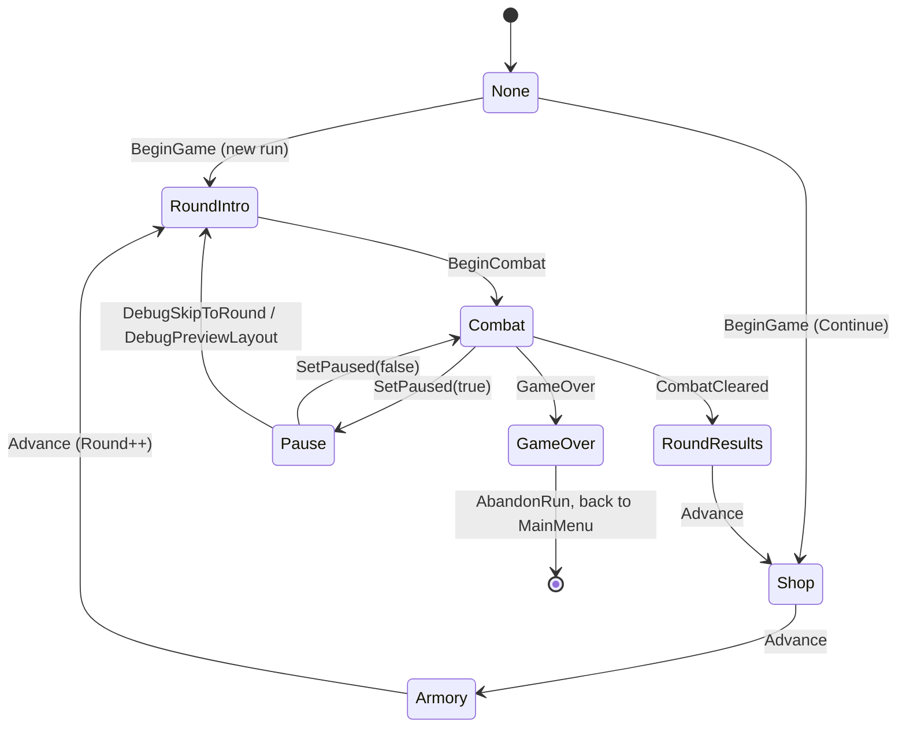
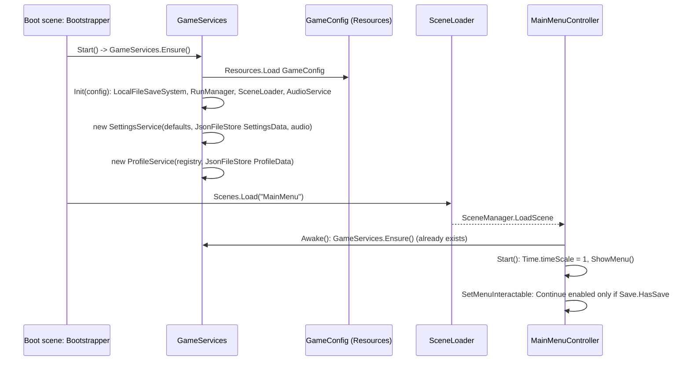
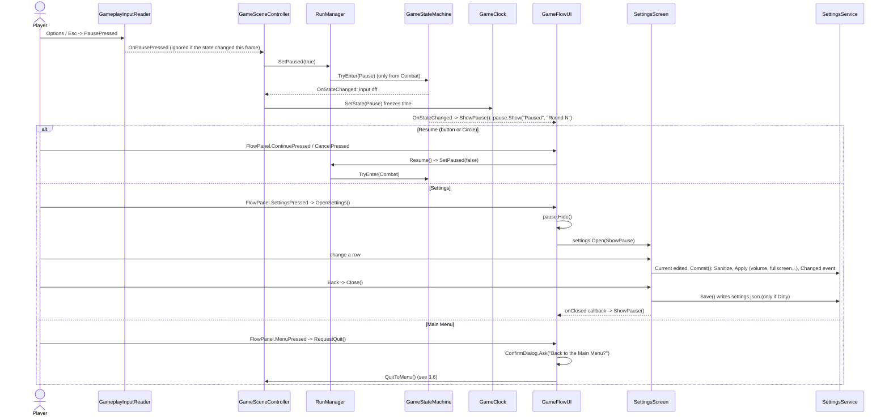
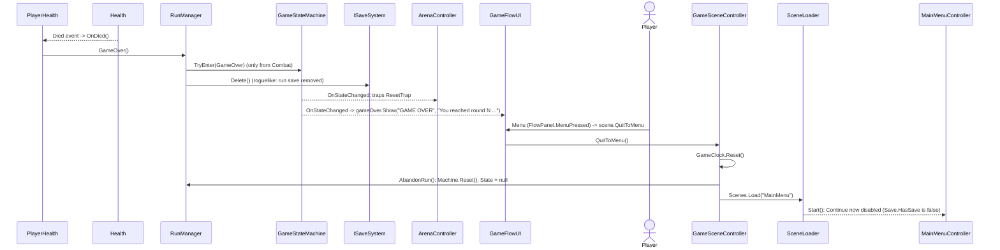

# 03 - Game Flow

How the game moves from launch to Game Over: scenes, the run state machine, and the call sequence of each major flow.
Every class and method named here was checked against `Assets/Scripts`. Anything inferred is marked **[VERIFY]**.

## 1. Scenes

| Scene | Path | Contents |
|---|---|---|
| Boot | `Assets/Scenes/Boot.unity` | One object with `Bootstrapper` (`Core/Bootstrapper.cs`). First scene in the build. Creates the persistent services, then loads the Main Menu |
| MainMenu | `Assets/Scenes/MainMenu.unity` | `MainMenuController`, `MenuPrimaryRouter`, `MenuInputReader`, `UIFocusGuard` (on the EventSystem), `SettingsScreen`, `CustomizationScreen` (with a `GladiatorCosmetics` preview and `GladiatorPreviewMotion`), `ConfirmDialog`, `HudPortrait`, `SafeAreaFitter`, and themed buttons (New Game, Continue, Settings, Quit) |
| Game | `Assets/Scenes/Game.unity` | The whole run. Root `GameFlow` object: `GameSceneController`, `GameFlowUI`, `MenuPrimaryRouter`, `MenuInputReader`. Gameplay: Player (`GameplayInputReader`, `ArmSelectionController`, `ArmFireController`, `AmmoSlots`, `PlayerHealth`, `JumpController`, ...), `Arena` (`ArenaController`, `ArenaScenery`, `TallObstacleFader`), `WaveSpawner`, `EnemyPool`, `BossPool` (an `EnemyPool`), `ProjectilePool`, `CoinField`, `Navigation` (`NavigationService`, `AiDebugView`), `Main Camera` (`CameraShake`). UI states inside the scene: `RoundIntro` (`RoundIntroBanner`), `WaveBanner`, `RunHud`/`CombatHud` (`HudHearts`, `HudHeatBar`, `HudAmmoSlot` x4, `HudPortrait`), `BossHud` (`BossHealthBar`), `RoundResultsPanel`, `PausePanel`, `GameOverPanel` (all `FlowPanel`), `ShopScreen` (+ `ShopTooltip`, `ShopCard`s), `ArmoryScreen` (+ `ArmoryRing`, `ArmorySlotButton` x8, `ArmoryBubble` x3, `ArmoryTether` x3, `ArmoryTabs`), `SettingsScreen`, `ConfirmDialog`, `DebugOverlay`, `DebugRoundPicker` (Boss / Go / Preview / HP buttons) |
| RigTest | `Assets/Scenes/RigTest.unity` | A dev-only rig test scene holding just a `RigTestAnim` component (2D Animation rigged test character from M8.6). Not in `SceneLoader` and not part of the flow (confirmed not in the build settings: only Boot, MainMenu and Game are) |

`SceneLoader` (`Core/SceneLoader.cs`) only knows `Boot`, `MainMenu` and `Game` (`SceneLoader.Load(name)` wraps `SceneManager.LoadScene`).
Shop and Armory are UI states inside the Game scene, not separate scenes.

## 2. GameStateMachine

Source: `Assets/Scripts/Core/GameStateMachine.cs`. States (`enum GameState`): `None, RoundIntro, Combat, RoundResults, Shop, Armory, Pause, GameOver`.

`GameStateMachine.IsAllowed(from, to)` permits exactly:

| From | To |
|---|---|
| `None` | `RoundIntro` (new run), `Shop` (Continue) |
| `RoundIntro` | `Combat` |
| `Combat` | `RoundResults`, `Pause`, `GameOver` |
| `RoundResults` | `Shop` |
| `Shop` | `Armory` |
| `Armory` | `RoundIntro` |
| `Pause` | `Combat`, `RoundIntro` (the debug round skip) |
| `GameOver` | nothing (terminal; `RunManager.AbandonRun` / `GameStateMachine.Reset` clear it) |

`TryEnter(next)` refuses illegal transitions and returns false; on success it sets `Previous`/`Current` and raises `StateChanged(from, to)`.
`Reset()` goes back to `None` without raising the event.

Who drives the transitions (`RunManager`, `Core/RunManager.cs`):

| Transition | Caller |
|---|---|
| `None -> RoundIntro` or `None -> Shop` | `RunManager.BeginGame()` (called by `GameSceneController.Start`), using `PendingStart` (`RoundIntro` after `StartNewRun`, `Shop` after `ContinueRun`) |
| `RoundIntro -> Combat` | `RunManager.BeginCombat()` (called by `RoundIntroBanner.StartBegin`) |
| `Combat -> RoundResults` | `RunManager.CombatCleared()` (called by `WaveSpawner` when the last wave is cleared) |
| `RoundResults -> Shop`, `Shop -> Armory`, `Armory -> RoundIntro` | `RunManager.Advance()` (wired to the Continue / Leave / Fight buttons by `GameFlowUI`) |
| `Combat <-> Pause` | `RunManager.SetPaused(bool)` (`GameSceneController.OnPausePressed`, `GameFlowUI.Resume`) |
| `Combat -> GameOver` | `RunManager.GameOver()` (called by `PlayerHealth.OnDied`) |
| `Pause -> RoundIntro` | `RunManager.DebugSkipToRound(round)` / `DebugPreviewLayout(round)` (from `DebugRoundPicker`) |



Side effects of a state change, all through `StateChanged`:
- `GameSceneController.OnStateChanged`: input is enabled only in `RoundIntro` and `Combat`; `GameClock.SetState(to)` freezes time everywhere else (results, shop, armory, pause, game over); confetti on `RoundResults`.
- `GameFlowUI.OnStateChanged`: hides all panels, then shows `roundResults`, `shop.Show`, `armory.Show`, the pause panel or the game-over panel.
- `ArmSelectionController.OnStateChanged`: on `Armory -> RoundIntro`, `Rebuild()` respawns the arms from the edited loadout.
- `ArenaController`: traps reset on `RoundResults` / `GameOver`.

Round events raised by `RunManager` (not states): `RoundIntroStarted(round)` (arena built/reset, enemies, bullets and coins cleared, player health refilled, jump cancelled) and `RoundStarted(round)` (traps begin, waves start).

## 3. Sequences

### 3.1 Boot to Main Menu



Pressing Play in any scene works: every scene's controller calls `GameServices.Ensure()`. With `-perfstress` on the command line,
`Bootstrapper` skips the menu: `Run.StartNewRun()`, sets `State.Round = 3`, loads `Game`.

### 3.2 New Game to Character Creation to Round Intro to Combat

```mermaid
sequenceDiagram
    actor P as Player
    participant MM as MainMenuController
    participant CD as ConfirmDialog
    participant CS as CustomizationScreen
    participant PS as ProfileService
    participant RM as RunManager
    participant SL as SceneLoader
    participant GSC as GameSceneController
    participant SM as GameStateMachine
    participant RIB as RoundIntroBanner
    participant WS as WaveSpawner

    P->>MM: New Game (OnNewGamePressed)
    alt a run save exists
        MM->>CD: Ask("Start a new run?")
        CD-->>MM: OnOverwriteConfirmed (replacesSave = true)
    end
    MM->>CS: OpenCustomization -> Open(OnLookConfirmed, ShowMenu)
    P->>CS: cycle slots (ProfileService.Cycle), Randomize
    P->>CS: To the Arena! -> Confirm()
    CS->>PS: Save() writes profile.json
    CS-->>MM: onConfirmed -> OnLookConfirmed
    MM->>MM: Save.Delete() only if replacesSave
    MM->>RM: StartNewRun() -> RunState.NewRun(config)
    MM->>SL: Scenes.Load("Game")
    SL-->>GSC: Awake: Ensure(), run.EnsureRun()
    GSC->>RM: Start(): BeginGame()
    RM->>SM: Machine.Reset(); TryEnter(RoundIntro)
    RM->>RM: StartRoundIntro() raises RoundIntroStarted(round)
    Note over RM,WS: ArenaController.Build, WaveSpawner clears field, PlayerHealth.ResetForRound, JumpController.CancelJump
    SM-->>RIB: StateChanged(None -> RoundIntro): ShowTitle(round)
    RIB->>RIB: Title -> Countdown (3-2-1) -> StartBegin()
    RIB->>RM: BeginCombat()
    RM->>SM: TryEnter(Combat)
    RM->>WS: RoundStarted(round) -> OnRoundStarted
    WS->>WS: GetRound, Difficulty.Evaluate(round), StartNextWave()
    WS->>WS: Update: SpawnScheduler.Tick -> Spawn -> Enemy.Initialize
```

Notes:
- The old save is deleted only when the look is confirmed (`MainMenuController.OnLookConfirmed`), so backing out of customization keeps it.
- During `RoundIntro` the player can move (`GameSceneController` keeps input on) but enemies and traps are idle until `RoundStarted`.
- `RoundIntroBanner` timings come from `CombatTuning` (`IntroBannerSeconds`, `CountdownSteps`, `CountdownStepSeconds`, `BeginSeconds`).

### 3.3 Round clear to Results to Shop to Armory to next round

```mermaid
sequenceDiagram
    actor P as Player
    participant WS as WaveSpawner
    participant RM as RunManager
    participant SM as GameStateMachine
    participant UI as GameFlowUI
    participant SH as ShopScreen
    participant SS as ShopService
    participant AR as ArmoryScreen
    participant SAVE as ISaveSystem

    WS->>WS: OnWaveCleared (last wave): coins.CollectAll()
    WS->>RM: CombatCleared()
    RM->>RM: State.Currency += RoundEarnings; LastReward set
    RM->>SM: TryEnter(RoundResults)
    SM-->>UI: StateChanged -> roundResults.Show("Round N cleared")
    P->>UI: Continue (FlowPanel.ContinuePressed)
    UI->>RM: Advance() [RoundResults]
    RM->>RM: State.Shop = ShopVisit.Create(seed)
    RM->>SAVE: SaveRun() -> RunSaveMapper.ToSave
    RM->>SM: TryEnter(Shop)
    SM-->>UI: StateChanged -> shop.Show(state)
    SH->>SH: BuildStock(): ShopStock.Generate(seed, round, rerolls, pool, table, tuning)

    rect rgb(235,245,235)
    Note over P,SH: Buy
    P->>SH: Cross on a card -> OnCardClicked
    SH->>SS: BuyOffer(state, visit, offer, entry)
    SS-->>SH: Bought / NotEnoughCurrency / AlreadySold
    SH->>SH: card.PlayBuy (SOLD stamp), RefreshLabels
    SH->>SAVE: run.SaveRun()
    end

    rect rgb(235,240,250)
    Note over P,SH: Reroll
    P->>SH: Triangle -> MenuInputReader.RerollPressed -> Reroll()
    SH->>SS: TryReroll(state, visit, tuning) (cost rises per reroll)
    SS->>SS: visit.NextStock(): Rerolls++, SoldMask = 0
    SH->>SH: BuildStock(); run.SaveRun()
    end

    rect rgb(250,243,230)
    Note over P,SH: Crate (pick 1 of 3)
    P->>SH: Cross on crate -> BuyCrate(card, offer, entry)
    SH->>SS: BuyCrate(...): pays, visit.CratePending = true
    SH->>SH: ShopStock.CrateChoices(...) -> OpenCrate()
    P->>SH: choose an armament -> OnCrateChoiceClicked
    SH->>SS: PickCrate(state, visit, crateOffer, chosen)
    SS->>SS: Armaments.Add(chosen); MarkSold(crate)
    SH->>SAVE: run.SaveRun()
    end

    P->>SH: Circle / Leave -> ContinuePressed
    SH->>UI: GameFlowUI: shop.ContinuePressed += run.Advance
    UI->>RM: Advance() [Shop]
    RM->>SM: TryEnter(Armory)
    SM-->>UI: StateChanged -> armory.Show(state)

    rect rgb(245,235,245)
    Note over P,AR: Armory: Ring -> Bubbles -> Picking
    P->>AR: Cross on a filled arm slot -> OnSlotClicked -> OpenBubbles(slot)
    AR->>AR: ShowBubbles: ArmoryBubble.Open + ArmoryTether.Link (1-3 bubbles)
    P->>AR: Cross on a bubble -> OnBubbleClicked -> BeginPickArmament
    AR->>AR: RebuildGrid() (Armaments tab), ArmoryPreview.Equip shows before/after
    P->>AR: Cross on an item card -> OnCardClicked -> EquipArmament(card, armament)
    AR->>AR: ArmInstance.TryEquipAt(slot, armament, state.Armaments)
    AR->>SAVE: run.SaveRun(); card.PlayFly -> bubble.Pulse
    P->>AR: Triangle on a bubble -> RemoveFocused -> ArmInstance.Unequip
    P->>AR: empty slot -> BeginPlaceArm -> PlaceSpare -> ArmoryActions.PlaceArm
    end

    P->>AR: Fight! (ContinuePressed)
    AR->>UI: armory.ContinuePressed += run.Advance
    UI->>RM: Advance() [Armory]
    RM->>SAVE: SaveRun() (round still R, so the save is "the Shop of round R")
    RM->>RM: State.Round++
    RM->>SM: TryEnter(RoundIntro); StartRoundIntro()
    SM-->>AR: ArmSelectionController.OnStateChanged: Rebuild() arms from State.Loadout
```

Notes:
- The Shop stock is never stored. It is regenerated from `(ShopVisit.Seed, round, Rerolls)`, so Continue shows the identical shop with the same SOLD flags (`SoldMask`). An open crate (`CratePending`) is not saved.
- The documented autosave points (`CLAUDE.md`) are "entering the Shop" and "leaving the Armory"; the code also saves after each Shop purchase, reroll and crate pick, and after each Armory change.
- `ArmoryScreen` has three levels (`enum Level { Ring, Bubbles, Picking }`); Circle (`OnCancel`) goes back one level. The last arm cannot be removed (`ArmoryResult.LastArm`).
- Incompatible items are dimmed (`ApplyDimming` uses `ArmoryPreview.Equip(...).CanEquip`).

### 3.4 Boss round: Pumpking

Round 3 is `Data/Waves/Rounds/Round_3.asset` (`isBossRound: 1`, one wave). `Data/Bosses/Boss_Pumpking.asset` has two phases: phase 1 enters at HP fraction 1, phase 2 at 0.5; each lists CircleSpread (kind 0), FastShot (kind 1) and JumpSmash (kind 2) attacks. `BossData.maxHealth` is 420.

```mermaid
sequenceDiagram
    participant RIB as RoundIntroBanner
    participant RM as RunManager
    participant WS as WaveSpawner
    participant BP as BossPool (EnemyPool)
    participant EN as Enemy
    participant EB as EnemyBrain
    participant BB as BossBehavior
    participant BC as BossController
    participant BJ as BossJump
    participant BE as BossEvents
    participant HB as BossHealthBar
    participant PL as PlayerHealth

    RIB->>RIB: ShowTitle: "BOSS ROUND 3" + "THE PUMPKING enters the colosseum!" (RoundData.FindBoss)
    RIB->>RM: BeginCombat()
    RM->>WS: RoundStarted -> StartNextWave(): banner shows boss name (WaveData.FindBoss)
    WS->>BP: PoolFor(data) picks BossPool because EnemyData.Boss != null
    WS->>EN: Initialize(EnemyData, position, difficulty, ...)
    EN->>EB: Configure(...) selects BossBehavior
    BB->>BC: Bind(EnemyAgent): phaseIndex = 0, jump.Configure(JumpTuning)
    BC->>BE: RaiseSpawned(this)
    BE-->>HB: Spawned -> Show (name plate, fill, phase tick)

    loop Phase 1 (per attack)
        BB->>BB: pick attack by weight (never the same kind twice), windup telegraph
        alt CircleSpread
            BB->>EN: EnemyAttacker fires ring volleys (AttackPattern)
        else FastShot
            BB->>BB: WarningLine then aimed shot
        else JumpSmash
            BB->>BC: Crouch(); TryJump(playerShadowPos)
            BC->>BJ: TryStart(target, MaxJumpDistance); SmashTelegraph.Show(landing ring)
            BJ-->>BC: Landed(at) -> Smash(at)
            BC->>PL: TryHit if grounded and inside radius; IDamageable.TakeDamage on other enemies
            BC->>BC: ring.Flash, dust/debris, CameraShake, hitstop
        end
    end

    Note over BC: Health.Changed -> OnHealthChanged: HP <= phase 2 threshold
    alt boss is airborne
        BC->>BC: pendingTransition = true (finish the jump first)
    end
    BC->>BC: StartTransition(): hitbox off (invulnerable), roar inflate, shake
    loop Update -> TickTransition
        BC->>BC: first half flash cycles, second half SetGlow(nextPhase)
    end
    BC->>BC: phaseIndex++, hitbox on
    BC->>BE: PhaseChanged event + BossEvents.RaisePhaseChanged
    BE-->>HB: OnPhase

    Note over BB,BC: Phase 2: denser rings, 3-shot FastShot bursts, JumpSmash chains, speed x1.35 (BossPhase)

    EN->>EN: Health.Died -> OnDied(): brain.Stop, attacker.Stop, navigation.Unregister
    EN->>BC: IDeathSequence.TryBegin(FinishDeath)
    BC->>BC: TickDeath: stagger (shake, debris bursts, flash strobe), squash, dissolve
    BC->>BC: FinishDeath(): coin burst VFX, BossEvents.RaiseDefeated
    BC-->>EN: onFinished -> Enemy.FinishDeath -> Defeated event
    EN-->>WS: OnEnemyDefeated: coins.Drop, pool.Release
    WS->>WS: scheduler.Finished and alive.Count == 0 -> OnWaveCleared
    WS->>RM: coins.CollectAll(); CombatCleared()
```

The round ends only after the death sequence finishes, because `Enemy` keeps the boss "alive" for wave-counting until `FinishDeath` raises `Defeated`.
The phase-2 multiplier and attack details are stated in `CLAUDE.md` and stored in `Boss_Pumpking.asset`; exact values should be read from the asset rather than from this document **[VERIFY]**.
`BossBehavior` calls `BossController.Bind(agent)` at line 49 of `BossBehavior.cs` (inside its `Begin`, presumably).

### 3.5 Pause and Settings



Pause can only be entered from `Combat` (`GameStateMachine.IsAllowed`). Settings are also reachable from the Main Menu (`MainMenuController.OnSettingsPressed` -> `settingsScreen.Open(ShowMenu)`); `SettingsService` also saves on `OnApplicationPause(true)` and `OnApplicationQuit`.

### 3.6 Game Over to Main Menu



`settings.json` and `profile.json` are untouched by Game Over.

### 3.7 Continue from save

```mermaid
sequenceDiagram
    actor P as Player
    participant MM as MainMenuController
    participant RM as RunManager
    participant SAVE as LocalFileSaveSystem
    participant MAP as RunSaveMapper
    participant REG as AssetRegistry
    participant SL as SceneLoader
    participant GSC as GameSceneController
    participant SM as GameStateMachine
    participant UI as GameFlowUI
    participant SH as ShopScreen

    P->>MM: Continue (OnContinuePressed)
    MM->>RM: ContinueRun()
    RM->>SAVE: TryLoad(out SaveData) (file exists, JSON parses, version == 1)
    RM->>MAP: TryFromSave(data, config.Registry, out RunState)
    MAP->>REG: GetArm / GetArmament / GetAmmo by ID (unknown IDs skipped with a warning)
    MAP-->>RM: RunState (false if no arms) and ShopVisit from seed, rerolls, sold mask
    RM->>RM: Machine.Reset(); State = loaded; PendingStart = Shop
    alt load failed
        RM-->>MM: false -> messageText "The save could not be loaded."
    else ok
        MM->>SL: Scenes.Load("Game")
        SL-->>GSC: Awake: run.EnsureRun() (State already set)
        GSC->>RM: Start(): BeginGame()
        RM->>SM: Machine.Reset(); TryEnter(Shop) (None -> Shop is allowed)
        SM-->>UI: StateChanged -> shop.Show(state)
        SH->>SH: ShopStock.Generate(seed, round, rerolls, ...) same stock and SOLD flags
    end
```

Continue skips character creation (the look comes from `profile.json` via `ProfileService`) and does not raise `RoundIntroStarted` until the player leaves the Armory, so the arena is first built for the next round at that point. The Shop the player resumes into is the Shop of the saved round `R`; leaving the Armory then increments to round `R + 1`.
