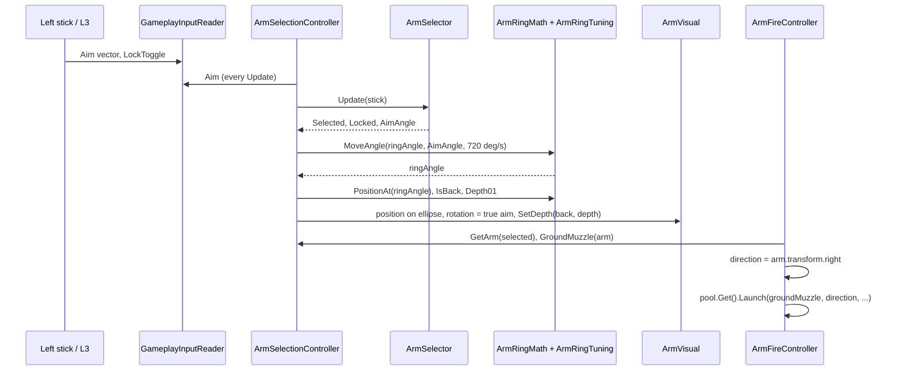

# System deep dive 01: Arm ring and aiming

Unity 6.3, 2D URP, new Input System. Two-stick control of up to eight weapon arms drawn on a flattened ellipse around the player's feet, in a 3/4 view where gameplay stays on the flat XY plane.

## Problem

The player moves with the right stick and does everything else with the left stick and one button. The game has eight arm slots and only one thumb. Three requirements pull against each other.

1. **Rapid switching.** In a bullet hell you need to change which arm is firing without a mode change or a menu. Direction-to-arm has to be something the thumb can do mid-dodge.
2. **Committed aiming.** A second mode is needed where one arm can be aimed freely through 360 degrees, because eight fixed directions are too coarse to hit a moving target.
3. **Readable in 3/4 view.** The art is drawn at an angle, but collisions, bullets and aim are flat 2D. Arms around the body must look like a ring lying on the ground (not a clock face on the chest). They must not hide behind the body when selected, and they must not lie about where bullets come from.

The design brief in `CLAUDE.md` states the rule in one line: "Aiming and bullets use the stick's true screen direction; the ellipse only changes where arms are drawn and where muzzles sit."

## Design

### Two selection states, one pure-logic class

`ArmSelector` (plain C#, no MonoBehaviour, no input device) holds the state machine `None / Soft / Locked`. It is fed a stick vector each frame and exposes `Selected`, `Locked` and `AimAngle` (compass degrees: 0 = N, clockwise).

- **Soft select.** Stick magnitude at or above `selectThreshold` (0.85) selects. Dropping below `deselectThreshold` (0.65) deselects. The 0.2 gap is the hysteresis band. While held, the selection only changes when the stick is clearly past the boundary between two arms: the selector requires the distance difference to exceed `2 x angleHysteresisDegrees` (8 degrees past the boundary, since the boundary is halfway between the two arms). The arm does not rotate; `AimAngle` is its home slot (`slot * 45`).
- **Locked (L3).** `ToggleLock` locks the soft-selected arm and snaps `AimAngle` to the stick. While locked, stick magnitude below `lockedAimDeadzone` (0.5) keeps the last angle, so releasing the stick does not drop the aim. L3 again unlocks, the arm returns to its home slot and soft select re-evaluates the stick. L3 with nothing selected does nothing.
- **Sensitivity.** `AimThresholds` scales the three thresholds by the player's aim-sensitivity setting (clamped: select 0.5-0.95, deselect 0.3-0.9, deadzone 0.15-0.8) and never lets deselect exceed select, so the hysteresis band cannot invert. At sensitivity 1 the asset values are returned exactly. The setting range is 0.6-1.5 (`SettingsDefaults`).

### Pie selection instead of eight fixed wedges

`CLAUDE.md` says "directions whose loadout slot is empty select nothing". The implementation does something different and arguably better: `NearestOwnedArm` picks the owned arm whose home angle is closest to the stick, so owned arms split the circle like a pie. One arm owned means the whole circle selects it (the starting loadout has a single arm). Two arms owned means a clean 180-degree split. This came in with the very first milestone (commit `c52770a`, "pie soft select"), which rewrote the CLAUDE.md Controls text to describe the pie. The "select nothing" wording came back in commit `6d96071` ("plan arm loadout system"), so the spec and the code disagree today. Tests: `OneArmOwned_AnyDirectionSelectsIt`, `TwoArmsOwned_SplitCircleHalfwayBetween`, `UnownedDirection_SelectsNearestOwnedArm` in `Assets/Tests/EditMode/ArmSelectorTests.cs`.

### The ring is a pure function plus a tuning asset

`ArmRingMath.Position(compassDegrees, radiusX, radiusY, verticalOffset)` returns `(sin a * rx, cos a * ry + lift)`, relative to the feet. `ArmRingTuning` holds the numbers (current asset values in `Assets/Data/Player/ArmRingTuning.asset`):

| Field | Value | Note |
|---|---|---|
| `radiusX` | 0.9775 | 0.85 x 1.15 (the character scale lock) |
| `radiusYRatio` | 0.6 | must equal the floor ratio F in `Docs/ART_SPEC.md` |
| `verticalOffset` | 0.115 | 0.1 x 1.15 |
| `spinDegreesPerSecond` | 720 | ring "spin" easing; 0 = snap |
| `backDeadzone` | 0.05 | anything further up the ring than this is "back" |
| sorting orders | back art -3, back halo -4, front art 3, front halo 2 | inside the player's `SortingGroup` (body 0, cape -1, headgear 2) |
| depth cue | back scale 0.9, front scale 1.05, back brightness 0.8 | subtle, toggleable |

`RadiusY` is derived (`radiusX * radiusYRatio`), so the ellipse can never drift away from the art spec ratio by editing two numbers.

### Drawing versus aiming are separate on purpose

`ArmSelectionController.PlaceArm(index, ringDegrees, aimDegrees)` takes two angles. The position comes from the ring angle. The rotation is `Quaternion.Euler(0, 0, 90 - aimDegrees)`, which points the arm along the true aim. While locked, a separate `ringAngle` eases toward `AimAngle` at `spinDegreesPerSecond` via `ArmRingMath.MoveAngle` (shortest way, so it crosses north correctly). The arm slides along the ellipse while its sprite already points the right way.

### Front/back sorting and the occluded silhouette

`ArmVisual.SetDepth` puts the art at `BackArtOrder` or `FrontArtOrder` depending on `ArmRingMath.IsBack`. Side slots (E, W) count as front. A selected back arm would vanish behind the body, so `ArmVisual.ApplySilhouette` lazily creates an "Occluded" child `SpriteRenderer` using a flat-colour material (alpha 0.6, arm ID colour) at `FrontArtOrder + 2`, so the chosen arm is always visible. Selection state is shown by a shader outline (soft: 1.5 texels at alpha 0.45; locked: 3 texels at alpha 1 with a pulse of 30 percent at speed 6), set through a `MaterialPropertyBlock` so the arm sprites stay batchable.

### Muzzles and the ground plane

Arms are drawn at the ring (lifted above the feet) but bullets live on the ground plane. `ArmSelectionController.GroundMuzzle` subtracts `GroundOffset` (the ring's lift plus current jump height) from the muzzle's world position, so bullets and beams start on the ground at the ellipse point, and the bullet sprite gets its visual lift separately (`PerspectiveTuning.BulletVisualLift`, 0.25). `ArmFireController.Fire` fires along `arm.transform.right`, which is the true aim.

### The same ring in the Armory

`Assets/Scripts/Armory/ArmoryRing.cs` reuses `ArmRingTuning` and `ArmRingMath` for the uGUI version (back arms, doll, front arms as three RectTransform layers, plus an `Image` silhouette for selected back arms). One ring definition, two renderers.

## Key classes

| Class | File path | Responsibility |
|---|---|---|
| `ArmSelector` | `Assets/Scripts/Player/ArmSelector.cs` | Pure selection state machine: soft/locked, hysteresis, pie split, aim angle |
| `InputTuning` | `Assets/Scripts/Input/InputTuning.cs` | Thresholds and deadzone as a ScriptableObject |
| `AimThresholds` | `Assets/Scripts/Input/AimThresholds.cs` | Scales thresholds by the sensitivity setting within safe limits |
| `GameplayInputReader` | `Assets/Scripts/Input/GameplayInputReader.cs` | Single owner of the generated `GameInput`; exposes `Aim`, `Move`, `FireHeld`, `LockTogglePressed` |
| `ArmSelectionController` | `Assets/Scripts/Player/ArmSelectionController.cs` | Spawns arms from the loadout, feeds the stick to the selector, ring spin, muzzle ground projection |
| `ArmRingMath` | `Assets/Scripts/Player/ArmRingMath.cs` | Ellipse position, front/back test, depth 0..1, angle easing |
| `ArmRingTuning` | `Assets/Scripts/Player/ArmRingTuning.cs` | Radii, offset, spin, sorting orders, depth cue, outline widths |
| `ArmVisual` | `Assets/Scripts/Player/ArmVisual.cs` | One arm's look: sorting, depth cue, outline, occluded silhouette |
| `ArmFireController` | `Assets/Scripts/Weapons/ArmFireController.cs` | Fires the selected arm from its ground muzzle along its facing |
| `ArmoryRing` | `Assets/Scripts/Armory/ArmoryRing.cs` | UI version of the ring using the same math and tuning |
| `ArmLoadout` / `WeaponArmData` | `Assets/Scripts/Weapons/ArmLoadout.cs`, `WeaponArmData.cs` | Eight-slot loadout and per-arm muzzle offset and art rotation |

## Data flow

Order matters: `ArmFireController` has `[DefaultExecutionOrder(10)]` so it reads the arm transforms after `ArmSelectionController` has placed them this frame. `ArmSelectionController.LateUpdate` moves the ring anchor up by `JumpController.Height`, so the ring rises with the body during a jump while the shadow stays down.

## Trade-offs and alternatives

- **Pie split vs fixed wedges.** Fixed wedges (the literal spec) mean a stick direction with an empty slot does nothing, which punishes a one-arm start. The pie split always selects something when the stick is at the rim. The cost: with two arms far apart, a large area of stick space maps to each, so a small stick slip near the boundary can switch arms. The 8-degree hysteresis and the gap between select and deselect thresholds are the mitigation.
- **Ellipse-on-the-ground vs a circle around the body centre.** The ellipse around the feet sells the 3/4 view and ties into the same ground ratio F as shadows and trap areas. The cost is two layers of sorting (back and front orders) and the silhouette hack for hidden arms. A circle would be simpler and would not need either.
- **Decoupling draw position from aim direction.** This costs one extra angle of state (`ringAngle`) but means a locked arm that visually sits at the back of the ring can still shoot toward the camera. The alternative, aiming along the line from the body to the arm position, would distort aim by the ellipse ratio.
- **Shader outline vs halo sprite.** The halo sprite was retired (`ArmVisual.halo` is still in the class but unused). The outline is a per-renderer `MaterialPropertyBlock` value. The catch is that the SRP Batcher warning on `Mat_SpriteOutline` (see Open questions).
- **Pure-C# `ArmSelector`.** Lets 25 or so edit-mode tests run without a scene, at the cost of the controller having to translate its state changes into events (`SelectionChanged`, `LockChanged`).

## What went wrong / lessons

- **Spec and code diverged.** `c52770a` updated `CLAUDE.md` to describe the pie, but `6d96071` (the next design commit) reintroduced "directions whose loadout slot is empty select nothing", and the Controls section still says so. Lesson: when behaviour changes during a milestone, the spec edit belongs in the same commit.
- **Armory focus ring was an opaque disc** covering the arm's base (found in M9d, `Docs/BUGS.md`, fixed by using a ring-shaped sprite in `M9cSetup.BuildSlotButton`). A focus indicator drawn from the solid circle sprite is a cheap mistake to make when sprites are reused.
- **Scale lock re-baked everything.** The ring, muzzles, jump height, footprints and nav radius were all re-baked when character scale was locked at 1.15x (the `ArmRingTuning` values are exactly 1.15 times the `CLAUDE.md` defaults of 0.85 and 0.1; muzzle offsets are about 0.69, which is 0.6 x 1.15). Keeping these as data assets made this a value edit, not a code change.
- **Character Creation still shows eight placeholder arms** around the doll and the front arms overlap the Randomize button (`Docs/BUGS.md`, UI2 mismatches). The ring was built for gameplay and the Armory, and the creation screen inherited it.
- **Armory ring is smaller than the mockup** (242 px against about 380 px) because doll size is tied to the same pixel scale (`BUGS.md`).

## Open questions

- Should soft select honour empty slots as the spec says, or should the spec be rewritten to describe the pie split officially? [VERIFY: the intended answer is not recorded anywhere I can find.]
- Locked aim is an instant snap (`CLAUDE.md` marks "tunable turn speed later"). There is no turn-speed field in `InputTuning`. Is the snap right for controller feel, or does a fast swing cause overshoot on stick release? [VERIFY: playtest result not documented.]
- The `ArmRingTuning` depth cue, back deadzone and spin speed are tuned by eye. No measurement links them to readability.
- Touch controls are TBD (M12); the two-stick model maps poorly to a single thumb pair. Whether the pie split would survive a virtual stick is untested.
- The 2D SRP Batcher warning on `Mat_SpriteCharacter` and `Mat_SpriteOutline` means arms, player and enemies are not SRP-batched. Deferred to M12.
