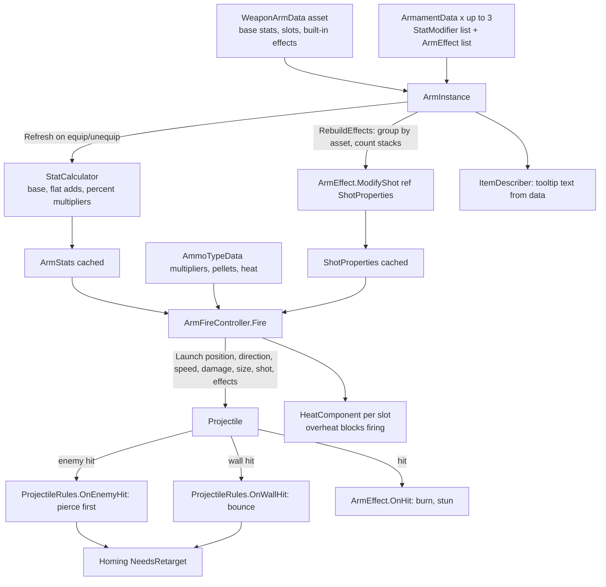

# System deep dive 04: Arms, armaments, effects, heat and ammo

How a weapon arm becomes a run-time object with stats and behaviours, how armaments modify it without touching the firing code, and how ammo types and heat sit on top. The authoritative rules are in `Docs/ARMAMENTS.md`; this file explains why they are shaped this way and where the code lives.

## Problem

The design wants roguelike build variety (Balatro / Slay the Spire style shop and equip loop) from a small code base:

- Eight arm slots, about six arm types, each arm carrying 1 to 3 armaments, where two arms of the same type can be kitted differently.
- New armaments (Homing, Pierce, Ricochet, Auto-fire, Velocity ...) must be new assets or classes, "never edits to the firing code".
- Stat maths has to be predictable when stacks multiply.
- Descriptions and tooltips must not go stale.
- Saves must survive balance changes (an arm that loses a slot, an armament whose stack limit drops).
- Assets must never be mutated at run time.

## Design

### Four layers, each with one job

1. **Arm type (`WeaponArmData`, asset).** Sprite, muzzle, ID colour, base stats (`damage`, `fireRate`, `projectileSpeed`, `projectilesPerShot`, `spread`, `projectileSize`), built-in `effects`, `armamentSlots` (1 to 3), rarity and price tier. Current assets (`Assets/Data/Arms`):

   | Arm | Damage | Fire rate | Bullet speed | Size | Slots | Rarity |
   |---|---|---|---|---|---|---|
   | Red | 6 | 1.2 | 10 | 0.6 | 1 | Common |
   | Blue | 0.5 | 12 | 18 | 0.2 | 2 | Common |
   | Green | 1 | 6 | 14 | 0.3 | 2 | Rare |
   | Ember | 1 | 6 | 14 | 0.3 | 2 | Rare |
   | Purple | 4 | 2 | 24 | 0.45 | 3 | Epic |
   | Piercer | 4 | 2 | 24 | 0.45 | 3 | Epic |

2. **Arm instance (`ArmInstance`, run state).** Wraps a `WeaponArmData` plus an `ArmamentData[3]` array (only `SlotCount` used). It caches `Stats`, `Effects`, `EffectStacks` and `Shot`, and rebuilds them only when an armament changes (`Refresh`). It exposes `TryEquip`, `TryEquipAt`, `Unequip`, `CanEquipAt` (with a human-readable reason), and raises `Changed` and a `Version` counter so UI knows when to redraw.

3. **Armament (`ArmamentData`, asset).** ID, name, icon, rarity, price tier, `ArmamentTags` flags, `maxStacks`, a `StatModifier[]` and an `ArmEffect[]`. Catalogue (`Assets/Data/Armaments`):

   | Armament | Rarity | Max stacks | Content |
   |---|---|---|---|
   | Velocity | Common | 4 | bullet speed, Percent +25 |
   | +50% Damage | Common | 4 | damage, Percent +50 |
   | +2 Fire Rate | Common | 4 | fire rate, Flat +2 |
   | +1 Projectile | Rare | 2 | projectiles, Flat +1 |
   | Homing | Rare | 3 | `HomingEffect` |
   | Pierce | Rare | 3 | `PierceEffect` |
   | Ricochet | Epic | 3 | `RicochetEffect` |
   | Auto-fire | Epic | 1 | `AutoFireEffect` |
   | Incendiary Rounds (Burn), Shock Rounds (Stun) | Rare | 2 | earlier test effects |

4. **Ammo type (`AmmoTypeData`, asset).** Decides projectile versus beam behaviour, scales the arm's stats at fire time (multipliers for damage, rate, speed, size, spread), adds pellets, and carries heat and spin-up numbers. Starter set: Basic (all multipliers 1), Shotgun (+5 pellets, +30 degrees spread, damage x0.5, rate x0.5), Laser (beam, damage x0.6, heat 0.35 per second), Gatling (damage x0.5, size x0.6, heat 0.02 per shot, spin-up 1.5 s from rate x0.3 to x2.5).

### Stat order

`StatCalculator.Calculate`: start at the base value, add all Flat modifiers, then multiply by all Percent modifiers, each as `x(1 + value/100)`. So two +50 percent modifiers give x2.25, not x2. Projectiles per shot is rounded and clamped to at least 1, fire rate to at least 0.01. Ammo multipliers apply afterwards in `ArmFireController.Fire` (`stats.Damage * ammo.DamageMultiplier` and so on). The calculation does not allocate.

### Behaviour: the `ArmEffect` hook set

The brief says behaviours are "small classes implementing a projectile/arm modifier interface". The code uses an abstract `ScriptableObject` base class, `ArmEffect`, with default no-op virtual hooks: `ModifyShot(ref ShotProperties, int stacks)`, `OnHit`, `OnBeamHit`, `Describe(int stacks, List<string>)`. Effects are shared and stateless assets. `ArmInstance.RebuildEffects` groups the arm's own effects plus every equipped armament's effects by asset (`IndexOf`), counts copies as stacks, calls `ModifyShot` once per distinct effect, and stores the result in `ShotProperties`. The firing code and `Projectile` only ever see `ShotProperties` and the effect list.

`ShotProperties` is a small struct (`Pierce`, `Bounces`, `HomingTurnRate`, `HomingCone`, `HomingRange`, `AutoFireRate`, `AutoFireArc`) copied into each bullet at launch (`Projectile.Launch` builds a `ShotState` with `PierceLeft` and `BouncesLeft`).

| Effect | Asset values | How it merges |
|---|---|---|
| `PierceEffect` | `pierceCount` 1 | `shot.Pierce += pierceCount * stacks` |
| `RicochetEffect` | `bounces` 3, `extraPerStack` 1 | `shot.Bounces += 3 + (stacks-1)` |
| `HomingEffect` | turn 120 deg/s (+60 per extra stack), cone 60 (+30), range 9 | takes the max of rate, cone and range |
| `AutoFireEffect` | rate x0.5, arc 45 (half-width) | takes the max; single stack only (`maxStacks` 1) |
| `BurnEffect` | 2 dps, 3 s, tick 0.5 | `OnHit` status effect |
| `StunEffect` | chance 0.3, 0.8 s | `OnHit` status effect |

### Interaction rules (fixed, in `ProjectileRules`)

From `Docs/ARMAMENTS.md`, enforced by pure functions and covered in `Assets/Tests/EditMode/M9aTests.cs`:

1. Pierce is used up before a bullet stops. `OnEnemyHit`: pierce left means the bullet continues and needs a new homing target.
2. Ricochet counts only wall or obstacle bounces. `OnWallHit` spends a bounce and reflects about the surface normal; enemy hits never spend bounces and wall hits never spend pierce.
3. Homing re-targets after every bounce or pierce (`NeedsRetarget` flag). Target choice: nearest live enemy not yet hit inside the forward cone and range (`InCone`).
4. Breakable obstacles take the bullet's damage before it bounces or stops. Beams ignore pierce, ricochet and homing.
5. Auto-fire fires only while the arm is not selected, at a target inside the slot arc and within the bullet's reach; beam ammo never auto-fires. Heat applies.

### Heat and ammo at fire time

`ArmFireController` keeps per-slot `FireTimer`, `HeatComponent`, `SpinUp` and a `LineRenderer` for beams, all created once in `Awake`. `HeatComponent` is a small shared model: heat builds per shot or per second; at 1.0 the arm overheats and cannot fire until it cools to `restartThreshold` (0.4 default, 0.3 for Laser and Gatling); heat decays only while not firing. Heat is fractions of the bar (`HeatSettings`), so switching ammo keeps an arm's heat meaningful. Cooling applies to every ammo so an overheated arm can always recover. Heat state is per arm slot and is reset when the arms are rebuilt from the loadout (`ResetSlots` on `ArmsRebuilt`).

### Descriptions and saves

`ItemDescriber.ArmamentLines` builds tooltip text from data: name, rarity and tags, one line per `StatModifier` (`+25% bullet speed`), each effect's `Describe(stacks)` and "Max N per arm". No description is written by hand. Saves store armament asset IDs only (`ArmSave.armamentIds`, resolved by `AssetRegistry`); on load, extras that no longer fit (fewer slots, over the stack limit) return to the inventory with a warning (tests in `M9aTests`: `SavedArmamentsThatNoLongerFitReturnToTheInventory`, `SavedCopiesOverTheStackLimitReturnToTheInventory`).

## Key classes

| Class | File path | Responsibility |
|---|---|---|
| `WeaponArmData` | `Assets/Scripts/Weapons/WeaponArmData.cs` | Arm type asset: art, muzzle, base stats, built-in effects, slots |
| `ArmInstance` | `Assets/Scripts/Weapons/ArmInstance.cs` | Run-time arm: armament slots, cached stats, effects, stacks, `ShotProperties` |
| `ArmamentData` | `Assets/Scripts/Weapons/ArmamentData.cs` | Armament asset: rarity, tags, stack limit, `StatModifier[]`, effects |
| `StatCalculator` | `Assets/Scripts/Weapons/StatCalculator.cs` | Base, then flat, then percent |
| `ArmStats` / `ShotProperties` | `Assets/Scripts/Weapons/ArmStats.cs`, `ShotProperties.cs` | Immutable stats; per-bullet behaviour struct |
| `ArmEffect` | `Assets/Scripts/Weapons/ArmEffect.cs` | Abstract effect asset with `ModifyShot`, `OnHit`, `OnBeamHit`, `Describe` |
| `HomingEffect`, `PierceEffect`, `RicochetEffect`, `AutoFireEffect`, `BurnEffect`, `StunEffect` | `Assets/Scripts/Weapons/Effects/` | The concrete effects |
| `ProjectileRules` | `Assets/Scripts/Projectiles/ProjectileRules.cs` | Interaction rules as pure functions |
| `ItemDescriber` | `Assets/Scripts/Weapons/ItemDescriber.cs` | Generated descriptions and summaries |
| `AmmoTypeData` | `Assets/Scripts/Weapons/AmmoTypeData.cs` | Ammo behaviour, multipliers, heat, spin-up |
| `HeatComponent`, `SpinUp` | `Assets/Scripts/Weapons/HeatComponent.cs`, `SpinUp.cs` | Heat and overheat; Gatling spin-up |
| `ArmFireController` | `Assets/Scripts/Weapons/ArmFireController.cs` | Per-slot timers, heat, beams, auto-fire, launch |
| `ArmamentInventory`, `ArmInventory`, `ArmLoadout` | `Assets/Scripts/Weapons/` | Owned items and the 8-slot loadout |
| `AmmoSlots`, `AmmoSlotSet` | `Assets/Scripts/Weapons/AmmoSlots.cs`, `AmmoSlotSet.cs` | Four face-button ammo slots |

## Data flow

## Trade-offs and alternatives

- **ScriptableObject base class versus a C# interface.** The spec asked for an interface; the code has `ArmEffect : ScriptableObject`. Benefits: effects are assignable in the inspector with their tuning values, reusable across armaments, and appear in the asset registry. Cost: effects cannot hold run state (enforced by convention and a comment, not by the compiler) and cannot be combined with other base classes.
- **Fold effects into `ShotProperties` once, not per bullet.** Bullets carry a struct instead of querying effect lists, and `ModifyShot` runs only when the loadout changes. The cost is that an effect whose behaviour needs per-bullet logic still needs a hook (`OnHit`, or new code in `Projectile`). Homing, pierce and ricochet needed new logic inside `Projectile` plus `ProjectileRules`; only the numbers are data. So "new armaments are assets, never edits to the firing code" holds for stat armaments and for new `OnHit` effects, but not for a new movement-type behaviour. [VERIFY: my reading of `Projectile.cs`; no statement in the docs either way.]
- **Stack semantics differ per effect.** Pierce adds per stack, Ricochet gives a base plus extras, Homing scales rate and cone per extra stack, Auto-fire is capped at one stack. This is deliberate and documented, but the player-facing rule is "it depends", which `Describe` papers over by printing the final numbers for the stack count.
- **Base, flat, percent ordering.** Predictable and easy to show in a tooltip. Percent stacks compound (x1.5625 for two +25 percent), so stacking a common armament gets strong quickly; `maxStacks` is the lever.
- **Heat as fractions of the bar on the ammo asset, per-arm state in `HeatComponent`.** One model covers Laser and Gatling and keeps values in data, but heat is tied to the active ammo's numbers, so swapping ammo mid-heat changes cooling speed immediately.
- **Per-instance armaments.** Two arms of the same type can differ, at the price of save format complexity (one ID per slot) and the stack-limit and slot-count reconciliation on load.

## What went wrong / lessons

- **Slot counts were an add-on.** M3b started with "ArmInstance with 3 armament slots"; M9a made them variable per arm (`WeaponArmData.armamentSlots`, 1 to 3). Save data had to handle both, hence the rule that extras return to the inventory with a warning, and the tests that pin it.
- **"Rarer arms get more slots" is only loosely true in data.** Red (Common) has 1, Blue (Common) has 2, Green and Ember (Rare) have 2, Purple and Piercer (Epic) have 3. Purple and Piercer are identical in every listed stat in `Assets/Data/Arms`, so the difference is the Piercer arm's built-in effect (its asset lists one effect entry, presumably Pierce) [VERIFY: the GUID was not resolved to an effect asset].
- **Test effects never left.** Burn, Stun, Damage, Fire Rate and Extra Projectile remain in the registry next to the starter catalogue (noted in `Docs/ARMAMENTS.md`). They cost nothing but blur the catalogue boundary for shop balance.
- **Ricochet bug report turned out to be the bug-format example.** The "Ricochet bullets pass through low walls" entry in `Docs/BUGS.md` was closed as "could not reproduce, works" after a check: a Low wall at (0, 1.6) reflected a Bounces=3 bullet correctly. The lesson is the value of the rules being in `ProjectileRules` and of the `F6` bullet-path debug view (cyan straight, green homing, yellow pierce, magenta ricochet, red stop).
- **Pierce interacts with hit memory.** `Projectile` remembers the last 8 colliders hit so a piercing or ricocheting bullet cannot re-hit the enemy it just left. Eight is a fixed array size, so a bullet with more than eight hits would forget the oldest. [VERIFY: stack limits make that unlikely (pierce max 3 stacks x 1, plus bounces), not proven.]
- **Colours collided across systems.** Purple/Piercer arm ID colours and Epic rarity were changed to avoid enemy bullet hues (gold, mint, emerald). Item identity colours and gameplay-critical colours share a namespace and need an audit (`Audit Reserved Hues` menu exists).

## Open questions

- Should behaviour effects move to a real interface (as the spec says) so non-ScriptableObject behaviours can be added, or is the abstract asset class the intended final design?
- Legendary rarity exists in `ArmamentRarity` and the spec but no Legendary armament is in the starter catalogue. [VERIFY: check `ArmamentRarity.cs` values and shop weights in `RarityTable`.]
- Homing scans all live enemies per bullet per frame (`Home`), and auto-fire scans them per arm; this is a named suspect in the P1 hitch list but unmeasured.
- Interaction between Auto-fire and Homing or Ricochet on off-selection arms is covered by the rules only implicitly. No test combines them. [VERIFY.]
- Should the same armament be able to exceed `maxStacks` across arms through the Armory? Currently the limit is per arm, by design ("a second arm can carry its own copies").
- Tooltip comparison ("stat before to after", "fits") is generated in `ShopDescriber` and `ArmoryPreview`, not `ItemDescriber`, and the UI2 mockup's chips and aligned rows are not built yet (`BUGS.md`).
