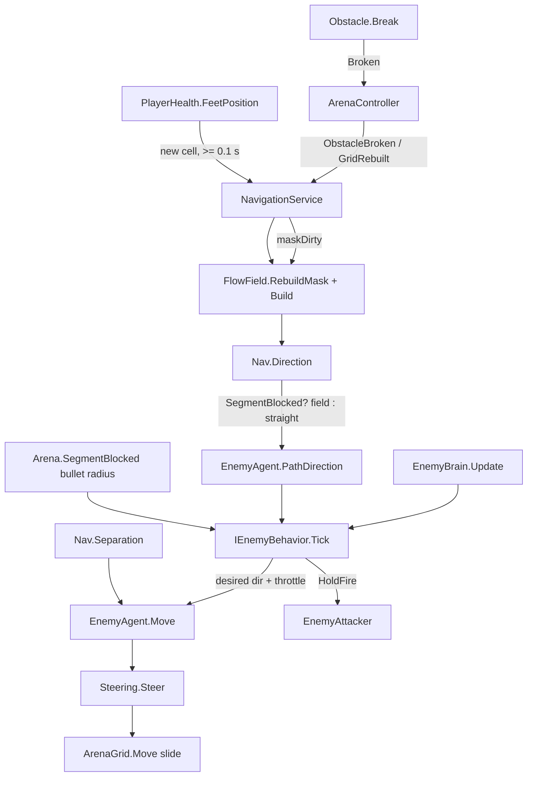
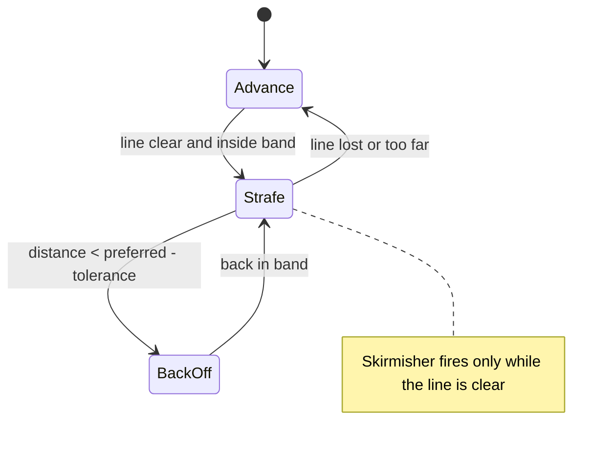

# 05 - Flow-Field Enemy AI

Milestone: M8 (commit `6fa1892`, "M8: enemy AI rework with flow field, steering, line of sight"). Code: `Assets/Scripts/AI`, `Assets/Scripts/Enemies`, `Assets/Scripts/Arena`. Tests: `Assets/Tests/EditMode/EnemyAiTests.cs`.

## Problem

The game is a bullet hell with "hundreds of bullets on screen" and a target of 60 fps on mobile/Switch (CLAUDE.md, Target platforms). The first enemies (M5a) were static shooters or patrol movers. CLAUDE.md asks for enemies that feel active and grounded: "enemies pursue, reposition and flank with acceleration/turning limits - no floaty drifting", and that "Ranged enemies need line of sight to fire; without it they reposition."

Constraints that shaped the solution:
- Many enemies at once (the stress test spawns 80), so per-enemy path search (A*) was not attractive; CLAUDE.md names a "grid flow field toward the player over the arena (cheap for many enemies), rebuilt when a breakable obstacle breaks".
- The arena has Solid and Breakable obstacles, Low and Tall height classes, and walls. Navigation has to honour the same footprints that block the player and bullets, or enemies will walk where bullets cannot and vice versa.
- Gameplay stays on the flat XY plane; the player can jump (fake height). Enemies must track where the player "is" on the ground, not the lifted sprite.
- No per-frame allocations in gameplay loops.

## Design

**One grid, three consumers.** `ArenaGrid` (uniform cells, default `cellSize` 0.25 on `ArenaController`) is the single collision picture. Each cell is `Free`, owned by an obstacle id, or `Border` (outside bounds). It answers `CircleBlocked`, `SegmentBlocked`, `RayDistance`, `Move` (slide with bisection) and `NearestFree`. Hostile bullets, player and enemy movement, spawn placement, the layout validator and the flow field all query it. `ArenaController` keeps three grids: `Grid` (movement), `BulletGrid` (taller, bullet headroom) and `TallGrid` (Tall obstacles and walls only, for a jumping player). Enemies and navigation never use `TallGrid`: they path around Low obstacles too.

**Flow field.** `FlowField` is plain data and maths. `RebuildMask(navRadius)` marks a cell walkable when a circle of the agent radius fits (`!grid.CircleBlocked(center, navRadius)`). `Build(target)` runs Dijkstra from the target cell using a hand-written allocation-free binary heap (arrays sized `cells * 10`), 8-neighbour with costs 1 and sqrt(2), and no corner cutting (a diagonal needs both adjacent orthogonals walkable). A second pass gives each cell a unit direction to its cheapest neighbour; cells inside an obstacle safety margin (non-walkable) point out to the nearest walkable neighbour so an enemy that got squeezed in can still escape. `Version` increments each build so the debug view knows when to redraw.

**NavigationService** (MonoBehaviour) owns the field and decides when to rebuild:
- target = `PlayerHealth.FeetPosition` (the ground position; stays on the ground during a jump),
- rebuild the mask on `ArenaController.GridRebuilt` (new round, `ResetRound`) and `ArenaController.ObstacleBroken`,
- rebuild the costs when the player enters a different cell, throttled by `EnemyAiTuning.MinRebuildInterval` (0.1 s),
- `Direction(position, radius)` returns the straight line to the player when `SegmentBlocked` is false (smooth movement in the open), otherwise `field.Direction(position)`.

**Separation.** `NavigationService` keeps a registry of live enemies (`Register`/`Unregister`). `Separation(self)` sums `Steering.PushAway` over all others: push grows linearly as footprints overlap (reach = both radii + `SeparationPadding` 0.23). It is O(n^2) in enemy count (called once per enemy per frame) and is listed as a suspect in the P1 perf notes.

**Steering.** `Steering.Steer` is a pure function: heading turns at most `EnemyData.TurnRate` deg/s, speed accelerates toward a target speed that drops to `TurnSlowdown` (0.35) when the heading is 90 degrees off, brakes with `EnemyData.Brake`, and the heading snaps freely below `PivotSpeed` (0.15). `EnemyAgent.Move` adds separation to the desired vector, steers, displaces along the grid, and if the move was clipped (>19% shorter) replaces velocity with what actually happened so enemies slide along walls instead of pushing into them.

**Behaviours.** `EnemyBrain` (per enemy) picks an `IEnemyBehavior` from `EnemyData.Behavior` and ticks it; behaviour objects are created once per brain and reused between spawns (`Begin`/`Tick`/`End`). `EnemyAgent` is the context object (positions, `PathDirection`, `HasLineToPlayer`, `FreeDirection`, `TryContactHit`).
- **Chaser** (`ChaserBehavior`): follows `PathDirection()` with a throttle that eases off near the player's footprint (no jitter); contact damage via `TryContactHit`. `Enemy_Grunt`: speed 2.7, accel 16, turn 420.
- **Skirmisher** (`SkirmisherBehavior` + `RangedPositioner`): advances when it has no line or is beyond `preferredDistance + tolerance`; backs off (with `FreeDirection` wall slipping) when too close; strafes in the band, flipping every `strafeSwitchSeconds` or on hitting an obstacle. Sets `Attacker.HoldFire = !line`. A visual-only pulse (`shotWarningSeconds`) precedes shots. `Enemy_Weaver`: preferred 5.5 +-0.9, speed 2.6.
- **Mobile Sentry** (`SentryBehavior`): walks to a spot with line of sight inside `sentryRange`, plants (speed below `PlantSpeed` 0.4), fires a stream, and feeds a shared `HeatComponent` through `EnemyAttacker.Fired`; at full heat it stops firing, crawls at `overheatedSpeedFraction`, gets a tint and steam VFX: the vulnerable window. `Enemy_Ringer`: range 3.5-7.5, `heatPerShot` 0.25, cool 0.22/s.
- Also `ChargerBehavior` (Approach, Telegraph, Dash, Recover; dash stops at first wall and is jumpable), `SniperBehavior` (warning line, one fast shot, preferred distance 8) and `BossBehavior` (see 06).

**Line of sight** is the same test bullets fly by: `Arena.SegmentBlocked(Enemy.BodyCenter, Player.Position, LosRadius 0.12, ...)`, so a ranged enemy only fires when its shot can arrive (note: to the player's damage core, not the feet).

**Jump awareness.** Pathing and aiming use `FeetPosition`. Contact is `TouchingPlayer = Player.IsGrounded && IsAlive && distance < radius + BodyRadius`, so an airborne player is passed over by chasers and chargers; traps check `IsGrounded` likewise. Bullets still hit an airborne player (`jumpDodgesBullets` toggle in `PlayerHealth`).

**Data.** Per-enemy numbers live on `EnemyData` (ScriptableObject; speed, acceleration, brake, turnRate, distances, sentry heat, charger/sniper timings, optional `BossData`). Shared numbers live on `EnemyAiTuning`: `navRadius` 0.5175 (0.45 x the 1.15 scale lock), `minRebuildInterval` 0.1, `separationPadding` 0.23, `separationWeight` 1.2, `turnSlowdown` 0.35, `pivotSpeed` 0.15, `plantSpeed` 0.4, `losRadius` 0.12.

## Key classes

| Class | File | Responsibility |
|---|---|---|
| `ArenaGrid` | `Assets/Scripts/Arena/ArenaGrid.cs` | Cell ownership, circle/segment/ray queries, sliding `Move`, `NearestFree` |
| `ArenaController` | `Assets/Scripts/Arena/ArenaController.cs` | Builds Grid/BulletGrid/TallGrid per layout; raises `GridRebuilt` and `ObstacleBroken` |
| `Obstacle` | `Assets/Scripts/Arena/Obstacle.cs` | `Break()` clears its cells from all grids, fires `Broken` |
| `LayoutValidator` | `Assets/Scripts/Arena/LayoutValidator.cs` | Checks clear spawn and a walkable lane from each gate (`DefaultLaneRadius` 0.45) |
| `FlowField` | `Assets/Scripts/AI/FlowField.cs` | Walkable mask, Dijkstra cost field, per-cell flow direction |
| `NavigationService` | `Assets/Scripts/AI/NavigationService.cs` | Owns the field, rebuild policy, `Direction`, enemy registry, `Separation` |
| `Steering` | `Assets/Scripts/AI/Steering.cs` | Pure steer / rotate / push-away maths |
| `EnemyAgent`, `IEnemyBehavior` | `Assets/Scripts/AI/EnemyAgent.cs` | Behaviour context and interface; `Move`, `HasLineToPlayer`, `FreeDirection` |
| `ChaserBehavior` / `SkirmisherBehavior` / `SentryBehavior` | `Assets/Scripts/AI/Behaviors/` | The three core archetypes |
| `RangedPositioner` | `Assets/Scripts/AI/Behaviors/RangedPositioner.cs` | Distance band, strafe and back-off logic |
| `ChargerBehavior`, `SniperBehavior` | `Assets/Scripts/AI/Behaviors/` | Variant archetypes with `WarningLine` telegraphs |
| `EnemyBrain` | `Assets/Scripts/Enemies/EnemyBrain.cs` | Chooses and ticks the behaviour; stun and player-dead handling |
| `EnemyData` | `Assets/Scripts/Enemies/EnemyData.cs` | Per-enemy tunables and `EnemyBehavior` enum |
| `EnemyAiTuning` | `Assets/Scripts/AI/EnemyAiTuning.cs` | Shared AI numbers (asset `Assets/Data/Enemies/EnemyAiTuning.asset`) |
| `AiDebugView` | `Assets/Scripts/AI/AiDebugView.cs` | Dev-build overlay: flow arrows, blocked cells, green/red LOS rays |

## Data flow

## Trade-offs and alternatives

- **Flow field vs per-enemy A*:** one Dijkstra per player-cell change serves every enemy. Cost is proportional to the grid (13.2 x 6.0 at 0.25 = about 53 x 24 = 1,270 cells, [VERIFY] exact counts), independent of enemy count. Downside: one target only; flanking is approximated by strafing and separation rather than distinct paths.
- **Straight-line shortcut:** when `SegmentBlocked` is false, enemies ignore the field and walk straight. Smoother and cheaper than following 8-direction arrows, at one segment sweep per enemy per frame.
- **Plain-data `FlowField`:** no engine objects, so it is unit-testable in EditMode (walls, unreachable target, breaking a wall opens a route).
- **Pure-function steering** rather than physics: deterministic, testable, allocation free; enemies do not use Rigidbody forces.
- **Separation O(n^2):** simple and readable; a spatial hash would scale better but was not needed at the current counts (see P1 notes).
- **Line of sight as a swept circle on the grid** instead of Physics2D raycasts: identical to the bullets' own blocking rule, no physics queries.
- **Coarse grid quantisation:** footprints are rasterised, so margins are cell-sized (0.25); `navRadius` is deliberately at least the largest walker.
- Alternative not taken: NavMesh (Unity AI Navigation). Rejected [VERIFY, inferred] because the game is 2D, obstacles break at runtime and the same grid already serves bullets.

## What went wrong / lessons

- `Docs/BUGS.md` has no AI-specific bug entries; `git log -p -- CLAUDE.md` shows the AI design was specified up front (M8 line and the Navigation bullet) and ticked off in the "M8: tick milestone in CLAUDE.md" commit. [VERIFY: no recorded post-mortem.]
- **Scale lock consequence:** the 1.15x character scale lock (CLAUDE.md milestones) forced re-baking `navRadius` (0.45 to 0.5175), footprints and layouts; `LayoutValidator.DefaultLaneRadius` is still 0.45 with a comment tying it to `navRadius`, so the two can drift apart. [VERIFY]
- **Arena resize (Fixed in BUGS.md, 2026-09-29):** shrinking ArenaData to 13.2 x 6.0 forced gates to sit 0.6 in from the border because the layout tests need a 0.6-radius lane: navigation constraints leaked into level design.
- **P1 hitches (Open in BUGS.md):** `Enemy.Brain` about 1.0 ms and `Nav.Separation` about 0.5 ms per frame in the 80-enemy stress test; hitch cause not attributed. `Separation` and per-frame LOS sweeps are named suspects but not proven.
- **Edit-mode test failure (Open):** 11 tests fail because `Obstacle.ApplyContactShadow` calls `GameServices.Ensure()`; unrelated to AI but it hits the `ArenaTests`/`LayoutTests` that cover the grid the AI depends on.

## Open questions

- Exact grid dimensions and flow build time in ms (PerfMarkers `FlowBuild` exists, no recorded number in docs). [VERIFY]
- Should a jumping enemy type use `TallGrid` for navigation? CLAUDE.md says "a jumping enemy type may come later".
- Does `Separation` need a spatial hash before the final performance test?
- Flow-field rebuild when many breakables break in one frame: currently one rebuild per `Update` (coalesced by `maskDirty`), which looks fine but is unmeasured. [VERIFY]
- Distinct flanking behaviour (CLAUDE.md says "flank") is not implemented as a dedicated mechanism; strafing and separation only. [VERIFY]
