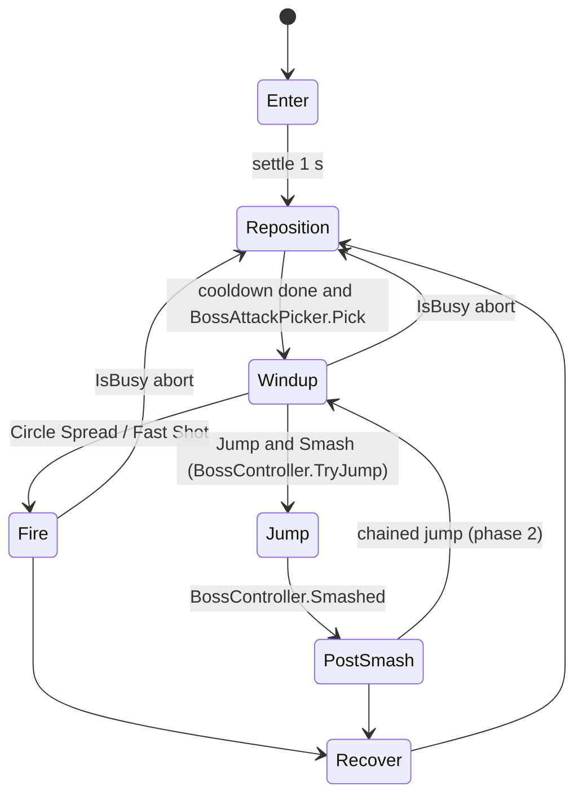
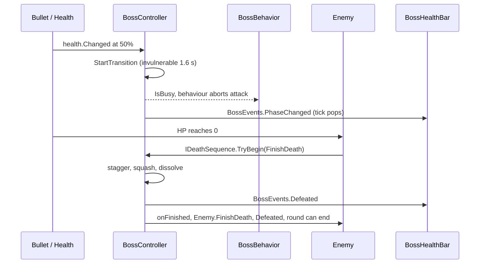

# 06 - The Pumpking (Round 3 Boss)

Milestone: M10 (round 3), commit `1a79436` ("M10: Pumpking round 3 boss; P1 (partial)"). Code: `Assets/Scripts/Bosses`, `Assets/Scripts/AI/Behaviors/BossBehavior.cs`, `Assets/Scripts/AI/BossAttackPicker.cs`, `Assets/Scripts/UI/BossHealthBar.cs`. Tuning: `Assets/Data/Bosses/Boss_Pumpking.asset`. Tests: `Assets/Tests/EditMode/BossTests.cs`.

## Problem

Round 3 needed a real boss fight that reads as a fight, not a bigger enemy: multi-phase, every attack telegraphed, a dramatic death, a health bar and a named intro banner. Constraints from CLAUDE.md:
- Bosses are an Enemy with `EnemyBehavior.Boss`, spawned from their own small pool, not a separate game object hierarchy.
- All numbers in data assets (architecture rule); no gameplay numbers in MonoBehaviours.
- Bosses are ground-based; "the jump is fake height like the player's (shadow stays on the ground, body sorts on the Airborne layer while high)".
- "Every attack has its own readable windup (toolkit inflate + tremble + DANGER pulse; the Fast Shot adds a warning line, the jump a crouch and a DANGER landing ring)".
- The round must end only when the death sequence finishes, not when HP hits zero.
- Art: one painted idle pose (`ArtSource/Bosses/Pumpking/boss_pumpking_idle.png`); windup/attack poses fall back to idle. Motion comes from the procedural toolkit (rigging bosses is deferred).

## Design

**Three layers, one enemy.**
1. `Enemy` (shared with every enemy) owns health, hurtbox, pooling, `Defeated`. It looks for an `IDeathSequence` component; if `TryBegin(FinishDeath)` returns true the body stays visible and the hitbox is disabled until the sequence calls back (`Enemy.cs`, death path).
2. `BossBehavior` (an `IEnemyBehavior`, picked by `EnemyBrain` when `EnemyData.Behavior == Boss`) is the state machine: Enter, Reposition, Windup, Fire, Jump, PostSmash, Recover. It chooses and performs attacks.
3. `BossController` (on `Boss.prefab`, a variant of `Enemy.prefab`) is the phase/transition/smash/death layer. `BossBehavior.Begin` calls `boss.Bind(agent)`; while `BossController.IsBusy` (transitioning or dying) the behaviour aborts its attack (`Abort`), stops, and starts over with `AbortCooldown` 0.6 s afterwards.

**Data.** `EnemyData.boss` points to a `BossData`; `EnemyData.MaxHealth` returns `BossData.MaxHealth` when set (still scaled by round difficulty). `BossData` holds: display name, `maxHealth` 420, `entrySettleSeconds` 1, `preferredDistance` (3, 5), `fastShotAimLockSeconds` 0.3, `recoilPunch` 0.1, `BossPhase[]`, a `JumpTuning` asset, and `SmashSettings`, `TransitionSettings`, `DeathSettings`. Each `BossPhase` has `EnterBelowHp01`, `MoveSpeedMultiplier`, a `BossAttack[]` and glow colour/amount/pulse. A `BossAttack` names a `BossAttackKind` (CircleSpread, FastShot, JumpSmash), an `AttackPattern` asset, windup seconds, volleys, volley interval, angle step, cooldown and weight. `BossData.PhaseIndexFor(hp01)` picks the last phase whose threshold the HP is at or below.

**Attack presets.** `AttackPattern` (`Assets/Scripts/Enemies/AttackPattern.cs`) is the same asset enemies use. Pumpking uses `Pattern_PumpkingRing` (Ring, 16 bullets, speed 4, size 0.34), `Pattern_PumpkingRingDense` (24 bullets, speed 4.4) and `Pattern_PumpkingFastShot` (Aimed, 1 bullet, speed 11, size 0.36), all with `bulletStyle` 1 = Hot Magenta (reserved boss/special hue from `EnemyBulletPalette`). [VERIFY: which pattern asset each phase's attack slot references; the phase YAML in `Boss_Pumpking.asset` only shows the pattern GUIDs.]

**Choosing attacks.** `BossAttackPicker.Pick(attacks, lastKind, roll01)` is a pure weighted pick that never repeats the previous kind when another kind is pickable, so it is unit-testable (`AttackPickerNeverRepeatsAKindWhenAnotherIsAvailable`). Phase 1 weights: Circle Spread 3, Fast Shot 2, Jump & Smash 2.

**Phases (from `Boss_Pumpking.asset`).**
- Phase 1: Circle Spread (windup 0.9 s, 2 volleys 0.45 s apart, +11.25 degrees per volley, cooldown 1.6); Fast Shot (windup 1.0 s, 1 shot, cooldown 1.4); Jump & Smash (windup 0.8 s, 1 jump, cooldown 2.2).
- Phase 2 at 50% HP: movement x1.35, Circle Spread 3 volleys (+5 degrees), Fast Shot 3-shot burst (0.18 s apart), Jump & Smash chains 2 jumps (second crouch `SecondJumpWindup` 0.35 s), persistent glow amount 0.15 pulsing at 6.

**Telegraphs.** `EnemyAgent`'s `Enemy.SetWindup(progress)` drives the `TelegraphFx` toolkit (inflate + tremble + DANGER-colour shader pulse). The Fast Shot also shows a `WarningLine` whose length is clipped by `Arena.BulletRayDistance` (same test bullets fly by), tracking the player until `fastShotAimLockSeconds` before the shot, then locking. Jump & Smash crouches (`CrouchSquash` 0.3) and `SmashTelegraph` shows a DANGER ring at `BossJump.LandingPoint`, resolved once at takeoff against walls and obstacles only.

**Jump & Smash.** `BossJump` reuses the player's jump pieces (`JumpTimeline`, `JumpTuning`, `LandingResolver`, `DustPuffs`): the root (feet, shadow, sort point) travels on the ground, the Rig rises on the arc (`Jump_Pumpking`: airtime 0.9, maxHeight 2.4), the hurtbox rises with it when `HittableInAir` is true, and the sorting group switches to the Airborne layer above `AirborneSortHeight` 0.08. On landing `BossController.Smash` does a physics-candidate then footprint test like `Trap.Strike`: radius 1.9 hurts grounded enemies (6 damage) and a grounded player (1 damage, `player.IsGrounded`), so the player can jump the smash; then 3 post-rings (`PostSpreads`, 0.25 s apart, 7.5 degrees step), shake, hitstop 0.06 s, dust and debris.

**Phase transition.** `OnHealthChanged` checks the next phase's `EnterBelowHp01`. If the boss is airborne it sets `pendingTransition` and starts the transition after the landing smash. `TickTransition` (1.6 s, invulnerable via disabling the hitbox, roar punch 0.35, flash cycles in the first half, glow ramping in the second half, shake 0.7, hitstop 0.1) then raises `PhaseChanged` and `BossEvents.RaisePhaseChanged`.

**Death sequence.** `BossController : IDeathSequence`. Stage 1 stagger 0.9 s (shake pulses every 0.15 s, 6 debris bursts of 8, flash strobe), stage 2 squash 0.3 s, stage 3 dissolve 0.9 s with smoke at 30% and sparks at 70%, then `FinishDeath`: 24-coin sparkle burst, `BossEvents.RaiseDefeated`, and the `onFinished` callback that makes `Enemy.FinishDeath` hide the body and raise `Defeated`, so the wave spawner and round end only see the boss gone when the show is over. Coins drop through the normal `EnemyData.coinValue`.

**Health bar.** `BossHealthBar` (screen-space, PrimeTween, unscaled time) subscribes to static `BossEvents.Spawned/PhaseChanged/Defeated` (no scene search, in line with "systems talk through events"), shows a name plate, fill, a slower trail (`trailSpeed` 0.8/s) and a phase tick that pops on phase change. `BossEvents` resets its statics with `RuntimeInitializeOnLoadMethod(SubsystemRegistration)` because Reload Domain is off. `RoundIntroBanner` shows "BOSS ROUND n" and the boss name from `RoundData.FindBoss()`.

**Debug tools.** `DebugRoundPicker` (Pause screen row): round -/+/Go, **Boss** (finds the first `IsBossRound` and calls `run.DebugSkipToRound`), **HP- / HP+** (`BossController.DebugSetHealth01` in 10% steps); `GameConfig.debugStartRound` starts New Game at a round; `BossBehavior.DebugStress` shrinks the pause between attacks (used by the stress test, `StressCooldown` 0.15 s).

**Pooling.** The boss uses `EnemyPool` with its `bossPool` flag, sized by `CombatTuning.bossPoolPrewarm` 1 / `bossPoolMax` 2. There is no class literally named `BossPool` despite CLAUDE.md's wording.

## Key classes

| Class | File path | Responsibility |
|---|---|---|
| `BossData` (+ `BossAttack`, `BossPhase`, `SmashSettings`, `TransitionSettings`, `DeathSettings`) | `Assets/Scripts/Bosses/BossData.cs` | All boss numbers as a ScriptableObject |
| `BossController` | `Assets/Scripts/Bosses/BossController.cs` | Phases, transition, smash damage, death sequence, glow |
| `BossJump` | `Assets/Scripts/Bosses/BossJump.cs` | Fake-height jump, landing point, airborne sorting, `Landed` event |
| `SmashTelegraph` | `Assets/Scripts/Bosses/SmashTelegraph.cs` | DANGER landing ring with progress and flash |
| `BossEvents` | `Assets/Scripts/Bosses/BossEvents.cs` | Static Spawned/PhaseChanged/Defeated hooks and `Active` |
| `BossBehavior` | `Assets/Scripts/AI/Behaviors/BossBehavior.cs` | Attack state machine, repositioning band, telegraphs |
| `BossAttackPicker` | `Assets/Scripts/AI/BossAttackPicker.cs` | Weighted no-repeat pick (pure) |
| `IDeathSequence` | `Assets/Scripts/Enemies/IDeathSequence.cs` | Optional death takeover contract on `Enemy` |
| `AttackPattern` | `Assets/Scripts/Enemies/AttackPattern.cs` | Bullet shape/speed/size/style preset |
| `BossHealthBar` | `Assets/Scripts/UI/BossHealthBar.cs` | Screen-space bar driven by `BossEvents` |
| `DebugRoundPicker` | `Assets/Scripts/UI/DebugRoundPicker.cs` | Boss skip and HP nudge buttons |
| `EnemyPool` | `Assets/Scripts/Enemies/EnemyPool.cs` | Pools enemies, with a boss-pool flag |

## Data flow

## Trade-offs and alternatives

- **Boss as an Enemy variant** reuses spawning, pooling, difficulty scaling, hit feedback and coin drops, at the cost of an `Enemy` that must tolerate a takeover of its death (`IDeathSequence`) and a behaviour (`BossBehavior`) that reaches into a second component (`BossController`). Alternative considered in CLAUDE.md: rigged bosses in parts, explicitly deferred.
- **Split between `BossBehavior` and `BossController`:** behaviour owns "what next", controller owns "what happens to me". It keeps the state machine readable but couples them via `Bind`/`IsBusy`/`Smashed`.
- **Data-driven phases and attacks** make a second boss a new `BossData` asset, but only three `BossAttackKind` values exist; a new kind needs code in `BossBehavior` and `BossData`.
- **Reusing the player's jump pieces** gave a consistent look and tested math but requires the boss to configure it (`BossJump.Configure`) and the landing is resolved once at takeoff so the telegraph is honest (the boss does not retarget mid-air).
- **Bullets hit the airborne boss** (`HittableInAir`, tunable) to keep it a bullet hell; the alternative (untouchable in the air) would punish the player for shooting at the wrong time.
- **Static `BossEvents`** avoid `FindObjectOfType` but are global state that must be reset manually.
- **Death ends the round only after the sequence** (about 2.1 s of stagger/squash/dissolve from `DeathSettings`): dramatic, but it adds a window where `IsAlive` is false yet the body is on screen, so the hitbox and brain must be carefully disabled (they are).

## What went wrong / lessons

- `Docs/BUGS.md` has no Pumpking-specific entry. Related open items: **P1 hitches** (stress test includes Pumpking phase 2 heaviest patterns; 30-70 ms hitches unattributed) and **"Destroy may not be called from edit mode"** (`ObjectPool<Enemy>.Clear` on leaving Play, includes pooled boss instances [VERIFY]).
- **Bullet colour lesson (Fixed in BUGS.md):** enemy bullets were red-family like the floor; the `EnemyBulletPalette` introduced Hot Magenta (#FF3DCB) specifically for boss and special shots, so Pumpking's rings read against the floor.
- CLAUDE.md's Bosses section was written after the fact (the commit adds "Pumpking (round 3, done)" to the spec), so the doc's "BossPool" wording does not match the code (an `EnemyPool` flag). [VERIFY: whether a rename is intended.]
- Windup and attack poses are not drawn yet; the boss currently reads its telegraphs purely via toolkit inflate/tremble/pulse. That worked as a constraint: telegraph readability does not depend on art.
- Design debt: `BossBehavior` and `BossController` constants (`RecoverSeconds` 0.35, `AbortCooldown` 0.6, `StaggerPulseSeconds` 0.15, reposition strafe 1.5-3 s and 0.6 throttle, death squash 0.45) are hard-coded, which bends the "no gameplay numbers in MonoBehaviours" rule.

## Open questions

- Rounds 5 and 7 bosses are TBD (still a placeholder wave, `Enemy_BossPlaceholder`); will `BossAttackKind` need new kinds or can phases recombine existing ones?
- Should the hard-coded timing constants move into `BossData`?
- Does the jump smash need an airborne-player interaction (player jumps over the ring; already true) and a fairness audit for chained jumps in phase 2? Not measured.
- Are windup/attack poses going to replace the fallback-to-idle, and will the toolkit telegraph stay on top of them? [VERIFY]
- Balance: no recorded playtest numbers on time-to-kill for 420 HP; the user says they playtest every change, results not in docs.
