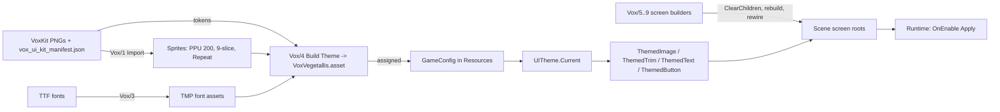
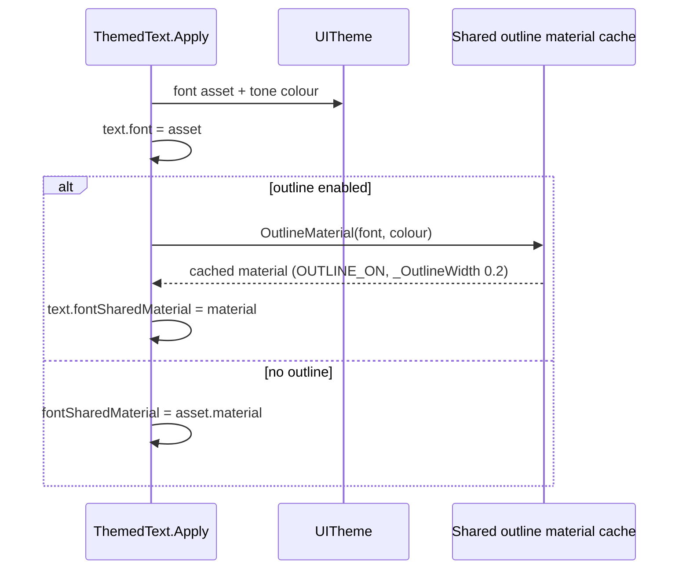

# 07 - The VoxVegetallis UI Theme System

Milestones: UI1 (commit `f74d79b`, first `UITheme` with the Mega Cozy stand-in pack), M9d (`a3a8740`, UI consistency pass), UI2 (commit `799d55b`, "VOX VEGETALLIS UI hot swap"). Code: `Assets/Scripts/UI`, `Assets/Editor/Vox*.cs`. Theme asset: `Assets/Data/UI/VoxVegetallis.asset`. Kit: `Assets/Art/UI/VoxKit`. Mockups: `Docs/Reference/UI`. Screenshots: `Docs/Screenshots/VoxUI`.

## Problem

The game has many screens (Main Menu, Settings, Character Creation, HUD, Shop, Armory, Pause, Results, Game Over, confirm dialogs), built first as plain skeletons (M4 to M9c) and then needing a real look ("M11 Themed UI/visual pass" was the plan). Requirements:
- One coherent look ("Garden Colosseum": marble panels, soil-brown outlines with hard drop shadows, corn-gold focus, leaf-green checker trims, tomato hearts) matching six mockups.
- Restyling must be a data edit: CLAUDE.md says "Screens never reference kit sprites directly" and "restyling means editing the theme asset or the kit art".
- Controller-first: focus must read clearly on every element; layout must not shift on focus.
- Art arrives as a 2x kit plus a JSON manifest of sizes, 9-slice borders and colour tokens, so import and theme building should be reproducible tools, not hand clicking.
- Solo developer; screens are built by editor scripts, so the pipeline has to be safe to re-run without breaking scene references.

## Design

**Data: `UITheme`** (`Assets/Scripts/UI/UITheme.cs`, a ScriptableObject referenced from `GameConfig`, loaded via `Resources` and cached in `UITheme.Current`, reset on `SubsystemRegistration`). It maps roles to assets:
- `ThemeRole` enum: Panel, Inset, Card, Slot, Tooltip, Header, Tab, TabSelected, PanelShade, PanelWood, PanelCorn, PillMarble, HintBar. `GetSprite(role)` / `GetColor(role)`.
- Button sprite set (`ButtonSprites`: normal, highlighted, selected, pressed, disabled) plus primary button; slider, toggle, card frames per rarity (`GetCardFrame`), ammo slots, armory bubbles and tether vine, hearts, heat bar, portrait ring, coin, pedestal/spotlight.
- `Palette` (inkSoil, marble, marbleShade, gold, goldDark, tomato, leaf, carrot, corn, sage, faintText, mutedText), rarity colours (common stone, rare leaf, epic carrot, legendary gold), heat gradient (`GetHeatColor`: leaf to carrot to tomato).
- Five TMP fonts: Title and Logo (Cinzel Decorative Bold/Black), Button (Lilita One), Body and BodyBold (Nunito SemiBold/ExtraBold).
- Metrics: `pixelScale` (kit imported at PPU 200, so art draws at half size on the 1080p canvas; `BorderMultiplier = 1 / pixelScale`), outline 6, drop shadow 9, focus lift 12 px / 0.12 s, card buy 0.35 s, bubble pop 0.25 s with 0.05 s stagger, screen transition 0.2 s, and UI sounds (`GetSound(UiSoundKind)`; silent when no clip).

**Components (read the theme, never the sprites):**
- `ThemedImage`: role to sprite and colour on an `Image`; 9-sliced when the sprite has a border; `pixelsPerUnitMultiplier` from the theme (or an override); `keepColor` for runtime-tinted frames. `[ExecuteAlways]`, re-applied in `OnEnable`/`OnValidate`, so editing the theme updates screens.
- `ThemedTrim`: tiled checker strip (`TrimColor` Leaf/Carrot/Tomato/Corn), whole number of checks at the theme's scale.
- `ThemedText`: `TextFont` (Body, BodyBold, Button, Title, Logo) and `TextTone` (OnPanel, OnDark, Gold, Muted, Faint, Tomato, Leaf, Sage, Custom) on a `TMP_Text`; `Caps` adds 6 units of tracking for small spaced labels; `Outline` swaps in a shared outline material.
- `ThemedButton`: sprite swap transitions, `ButtonKind` Normal or Primary (red "Fight!"), font and colour for every child label, and a confirm sound on click.
- `FocusDecor`: shows decor children (checker trims at both button ends, laurels, gold ring) and lifts the element by the theme lift while selected or hovered (`ISelectHandler`, pointer handlers); decor are plain children so layout is untouched.
- `SettingRow` with `SettingKind`: Choice (arrows around a value, left/right to change), Slider (track, handle and number), Toggle (pill switch with ON/OFF). Used by Settings and the Character Creation part list. A click steps a slider forward; it does not jump to the click position.

**Tools (all under the `BulletHell/Vox/` menu, each safe to re-run):**
1. `1 Import Kit Sprites` (`VoxKitSetup.ImportKit`): reads `vox_ui_kit_manifest.json`, applies sprite import settings (PPU 200, `UiPpu`), 9-slice borders (`nine_slice_border_LTRB`), uncompressed, Repeat wrap for checker trims. `1b Assign Kit Icons`, `2 Import TMP Essentials`, `3 Create TMP Font Assets`.
2. `4 Build Theme` (`VoxThemeSetup`): builds `VoxVegetallis.asset` from manifest tokens and sprites (palette, rarity, heat, text colours, metrics), assigns it to `GameConfig` (`Assets/Resources/GameConfig.asset`), sets TMP defaults and fallbacks, deletes the retired Mega Cozy theme asset. `4b Refresh Themed Prefabs` re-applies the theme to every themed prefab.
3. `5 Build Backdrop Texture`, `6 Build Row Prefabs`, `7 Build Main Menu Scene` (`VoxMenuScreens`), `8 Build Game HUD And Panels` (`VoxGameScreens`), `9 Build Shop And Armory` (`VoxShopArmory`). Builder helpers in `VoxUi` (`Themed`, `Txt`, `Btn`, `HintPill`, `ClearChildren`, anchor helpers that take 1080p canvas units from the mockups: "display px x 0.96").
4. `Text Migration/A` and `/B` (`VoxTextMigrate`): one-shot legacy `Text` to `TextMeshProUGUI` conversion across all scenes and prefabs. Phase A records every serialized reference to a legacy Text and swaps the component; phase B, after scripts declared `TMP_Text` fields, restores references. The reference list goes to a scratchpad JSON so it survives the recompile between phases.
5. `VoxShots.Capture/CaptureNamed`: renders the main camera plus overlay canvases to a PNG at a chosen size without needing Game view focus (overlay canvases are temporarily switched to a capture camera), used to compare built screens with mockups.

**Rebuild without breaking scenes.** The screen builders keep each screen's root GameObject and its components (routers, `SettingsScreen`, `ConfirmDialog`, `FlowPanel`, etc.), call `VoxUi.ClearChildren(root)` (`DestroyImmediate` on children) and recreate and rewire the children (for example `VoxMenuScreens.RebuildSettings(screen, dimAlpha)`, `RebuildConfirm`). Scene references to the roots stay valid, which is why the same scripts can be re-run after kit or theme changes.

**The earlier UI1 theme.** UI1 shipped the same architecture (a `UITheme` asset, `ThemedImage`, `ThemedButton`) over the third-party "dobo Mega Cozy" demo sprites copied to `Assets/UI/DoboCozy`, with `Editor/UiThemeSetup.cs` and `UiThemeCapture.cs` (both now gone). UI2 swapped the content, not the pattern: it removed the pack, its theme asset and `DoboCozy`, added ThemedTrim/ThemedText/FocusDecor, and converted all text to TMP. `Docs/CREDITS.md` records that no third-party UI sprite pack remains.

## Key classes

| Class | File path | Responsibility |
|---|---|---|
| `UITheme` (+ `ThemeRole`, `TrimColor`) | `Assets/Scripts/UI/UITheme.cs` | Roles to sprites/colours/fonts/metrics/sounds; `Current` accessor |
| `ThemedImage` | `Assets/Scripts/UI/ThemedImage.cs` | Applies a role's sprite/colour/9-slice scale to an Image |
| `ThemedTrim` | `Assets/Scripts/UI/ThemedTrim.cs` | Tiled checker strip |
| `ThemedText` (+ `TextFont`, `TextTone`) | `Assets/Scripts/UI/ThemedText.cs` | Font, tone, caps, shared outline material for TMP |
| `ThemedButton` (+ `ButtonKind`) | `Assets/Scripts/UI/ThemedButton.cs` | Sprite-swap button, label theming, click sound |
| `FocusDecor` | `Assets/Scripts/UI/FocusDecor.cs` | Focus/hover decor and lift |
| `SettingRow` (+ `SettingKind`) | `Assets/Scripts/UI/SettingRow.cs` | Choice / Slider / Toggle row |
| `VoxKitSetup` | `Assets/Editor/VoxKitSetup.cs` | Manifest-driven sprite import, TMP essentials, font assets |
| `VoxThemeSetup` | `Assets/Editor/VoxThemeSetup.cs` | Builds/assigns the theme asset, refreshes prefabs |
| `VoxMenuScreens`, `VoxGameScreens`, `VoxShopArmory` | `Assets/Editor/` | Rebuild each screen's children in place |
| `VoxUi` | `Assets/Editor/VoxUi.cs` | Shared builder helpers (themed Image/Text/Button, ClearChildren) |
| `VoxTextMigrate` | `Assets/Editor/VoxTextMigrate.cs` | Text to TMP two-phase migration |
| `VoxShots` | `Assets/Editor/VoxShots.cs` | Headless-ish screenshot capture of overlay UI |
| `GameConfig` | `Assets/Scripts/Core/GameConfig.cs` | Holds the `UITheme` reference (Resources) |

## Data flow

## Trade-offs and alternatives

- **Role-based theme asset vs per-screen styling:** more indirection (every screen element needs a role), but a reskin (Mega Cozy to Vox) changed content while screens and components stayed. The cost: roles had to be added as mockups demanded (PanelCorn, PillMarble, HintBar).
- **`[ExecuteAlways]` themed components** show the theme in the editor and on prefabs, but apply work on every `OnValidate`, and `ThemedText.Apply` has to skip inactive objects (TMP cannot create material instances on inactive objects).
- **Scripted screen builders vs hand-authored prefabs:** reproducible and diffable against mockups (positions come from mockup pixels x 0.96), at the price of a parallel universe of editor code. BUGS.md warns that `M4Setup..M9dSetup`, `Cc1Setup`, `M75Setup` still contain the old skeleton builders and must not be re-run.
- **uGUI kept** (Canvas, Image 9-slice, TMP) rather than UI Toolkit, consistent with controller navigation built on `Selectable`/EventSystem. [VERIFY: whether UI Toolkit was formally evaluated]
- **Static font atlases** (per BUGS.md, "Fonts") keep the build simple but give no runtime glyph adding, so missing glyphs such as arrows fall back to Liberation Sans. [VERIFY: `VoxKitSetup.CreateFontAssets` passes `AtlasPopulationMode.Dynamic` when creating the asset; BUGS.md says static, so they may be baked afterwards.]
- **Generated blur backdrop** (`Assets/Art/UI/Backdrop/backdrop_blur.png`, `Vox/5`) instead of a real blurred render: cheap and deterministic, but softer than the mockup.

## What went wrong / lessons

- **Shared-outline-material lesson (from UI2 work, recorded in the code comment in `ThemedText.Apply` and CLAUDE.md "UI theme"):** the first TMP conversion set outlines with TMP's per-label properties (`label.outlineWidth = 0.2f; label.outlineColor = ...`; the same lines appear in an earlier `UiBuilder` diff). That makes TMP create a per-label material instance. When the theme later changed the label's font, the instance went stale and kept the old font's material, so the label drew glyphs from the wrong font atlas. The fix: one shared outline material per font and colour (`ThemedText.OutlineMaterial`, key = font instance id + colour, `HideAndDontSave`, cache cleared on `SubsystemRegistration`), assigned through `fontSharedMaterial`. `ThemedButton` likewise assigns the font's shared material. Rule: never use TMP's per-label outline properties. [VERIFY: the exact visible symptom is taken from the code comment; no screenshot of the bug in the repo.]
- **Mockup gaps logged, not hidden** (Open in BUGS.md "UI2 mockup differences"): focused main-menu button is not larger; hint pill uses text prompts not glyph icons; heat bar is one blended tint instead of three zones; Shop detail panel lacks rarity chips and the Fits box because tooltip data is free text from `ShopDescriber`; Armory ring is 242 px vs about 380 px in the mock; cards are 4 portrait columns rather than 3 landscape columns; Settings slider steps rather than following clicks.
- **Stale documentation:** `Docs/Screenshots/UI1` and `UI1/theme_sheet.png` still show the removed Mega Cozy pack (BUGS.md asks to delete the folder).
- **Nunito static weights:** Google Fonts ships only a variable Nunito, which TMP cannot pick weights from; the static 600 and 800 come from the `@expo-google-fonts/nunito` npm package (`Docs/CREDITS.md`).
- **M9d audit (`Docs/UI_AUDIT.md`)** found hard-coded hint text, no shared transition, silent UI sound slots and focus differences per screen; it drove `ConfirmDialog`, `ScreenTransition`, `UiSound` and live `ButtonGlyph` prompts before the reskin, which made the UI2 swap cheaper.
- **Save path changed:** UI2 also renamed the product to VoxVegetallis; the save folder changed and old saves were not carried over (CLAUDE.md).
- The Phone-portrait issue (Fixed, M9d) was resolved by a design decision (landscape only) rather than a portrait layout.

## Open questions

- Should the Main Menu focused button be larger, and the hint pill use glyph sprites from `ButtonGlyphLibrary` instead of text?
- Shop detail panel: build rarity/tag chips and a structured "Fits" box by giving `ShopDescriber` structured output instead of free text?
- Touch layouts at M12: does the 1080p canvas plus `SafeAreaFitter` scale well enough on phones, given the old portrait finding?
- Will the dynamic vs static atlas question matter once localisation arrives (CJK)? [VERIFY]
- Retire `M4Setup..M9dSetup` screen builders to avoid accidental re-runs?
- Regression coverage: no EditMode test for the theme or the themed components was found in `Assets/Tests/EditMode`. [VERIFY]
