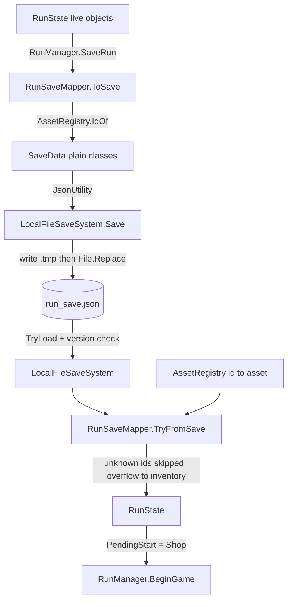
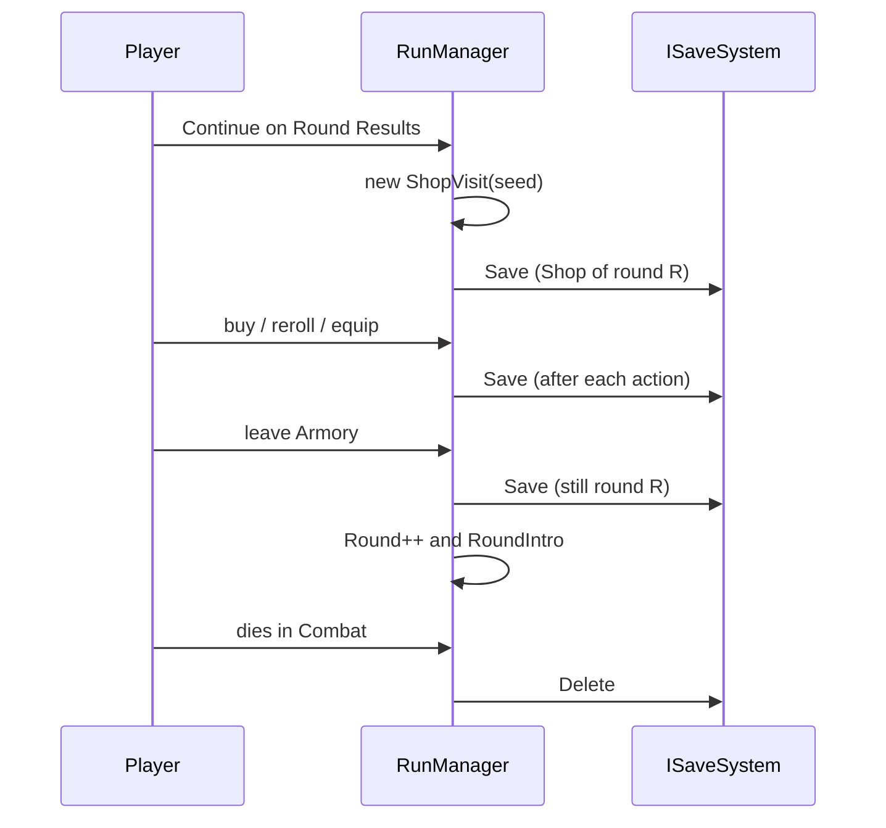

# 08 - Save System (run save, settings, profile)

Code: `Assets/Scripts/Save`, `Assets/Scripts/Core` (`RunManager`, `RunState`, `GameServices`), `Assets/Scripts/Settings`, `Assets/Scripts/Cosmetics` (`ProfileData`, `ProfileService`). Tests: `Assets/Tests/EditMode/GameFlowTests.cs`, `Assets/Tests/EditMode/M6Tests.cs`. Introduced in M4 (single-slot save), extended in M6 (settings, profile), M9b (saved shop visit), CC1 (profile v2).

## Problem

A roguelike with a shop and armory between rounds needs to survive quitting: Continue must resume at the Shop for the saved round. CLAUDE.md fixes the rules up front:
- Exactly ONE run save (single slot), JSON, written through an `ISaveSystem` interface so platform save APIs (Steam Cloud, iCloud, console save data) can plug in later.
- Settings and profile (chosen cosmetics, future unlocks) live in separate files that Game Over and New Game never delete. The profile also holds `tutorialDone` (D2): an older v2 profile without the field reads as not done, so no version bump was needed.
- "Save data uses plain serializable classes and asset IDs, never direct ScriptableObject references (an AssetRegistry maps IDs -> WeaponArmData / ArmamentData / AmmoTypeData)."
- Game Over deletes the run save (roguelike). Autosave when entering the Shop after each round, and after leaving the Armory.
- Console-ready from day one: no platform-specific code outside `Scripts/Platform/`.

## Design

**Interface.** `ISaveSystem` (`HasSave`, `TryLoad(out SaveData)`, `Save(SaveData)`, `Delete()`). `LocalFileSaveSystem` implements it with one JSON file. `GameServices.Init` builds it at `Application.persistentDataPath` + `GameConfig.SaveFileName` (`run_save.json`); settings are `settings.json`, profile `profile.json` (names on `GameConfig`). The product name was changed to VoxVegetallis in UI2, so the folder moved and old saves were not carried over (CLAUDE.md, UI2).

**Safe writes.** `LocalFileSaveSystem.Save` and the generic `JsonFileStore<T>` (used for settings and profile) write to `<file>.tmp` and then `File.Replace` (or `File.Move` the first time), so a crash mid-write leaves the previous save intact. A file that cannot be read, or has a different version, is reported as "no usable save" with a warning, never thrown. `Delete` removes both the file and any temp file. Serialisation is Unity's `JsonUtility` (pretty-printed), which is why the data classes are plain `[Serializable]` fields and arrays (no dictionaries, no polymorphism).

**Data classes.** `SaveData` (`CurrentVersion = 1`): `version`, `round`, `currency`, `loadout` (`ArmSave[]`, 8 slots N, NE, E, SE, S, SW, W, NW, empty = `armId ""`), `spareArms` (`ArmSave[]`), `armamentInventory` (`string[]` of IDs), `ammoSlots` (4 IDs, "" = empty), `activeAmmoSlot`, plus the shop visit (`shopSeed`, `shopRerolls`, `shopSoldMask`). `ArmSave` = `armId` + `armamentIds[]` (one per armament slot). The shop stock itself is not stored: Continue regenerates the same stock from `shopSeed`, rerolls and the sold bitmask.

**IDs, not references.** `AssetRegistry` (ScriptableObject at `Assets/Data/AssetRegistry.asset`) holds arrays of `WeaponArmData`, `ArmamentData`, `AmmoTypeData`, `CosmeticPartData` and the paper-doll Sprite Library. Each asset has an explicit `Id` field (for example `Arm_Red`, `Armament_Homing`, `Ammo_Basic`, `body_original`), not its file name, so renaming or moving a file never breaks a save. Lookups build a dictionary lazily and log an error for empty or duplicate IDs. The registry is filled by the editor menu `BulletHell/Collect Asset Registry`.

**Mapping.** `RunSaveMapper.ToSave(RunState)` and `TryFromSave(SaveData, AssetRegistry, out RunState)` convert between live state and plain data. Load is tolerant: unknown IDs are skipped with a warning; saved armaments that no longer fit an arm (fewer slots or full stack limit) are returned to the armament inventory instead of lost; a save with no usable arm returns false (Continue then fails gracefully); ammo with unknown IDs leaves the slot empty. `RunState` is the single owner of run data (round, currency, `Loadout` of `ArmInstance`, `SpareArms`, `Armaments`, `Ammo`, `Shop`), so nothing else needs saving.

**Autosave points (`RunManager`).** The save always describes "the Shop of round R":
- `Advance()` from RoundResults: creates a new `ShopVisit` (new seed) then `SaveRun()`, then enters Shop.
- `Advance()` from Armory: `SaveRun()` then `State.Round++` then RoundIntro, so the round number in the file is still the one whose Shop was visited.
- Beyond the spec: `ShopScreen` saves after a purchase, reroll and crate pick; `ArmoryScreen` saves after every equip, unequip, arm placement and arm removal. This makes the saved shop visit (sold mask, rerolls) and loadout match what the player sees.
- `GameOver()` calls `saveSystem.Delete()`. `AbandonRun()` (back to menu) leaves the save untouched.
- `ContinueRun()` loads, maps, resets the state machine, sets `PendingStart = GameState.Shop`; an old save with no shop visit gets a new one.
- Main Menu New Game with an existing save asks to confirm; the old save is deleted only after the player confirms their gladiator look (`MainMenuController.OnLookConfirmed`), so backing out keeps the run.

**Settings.** `SettingsData` (`CurrentVersion = 1`): master/music/SFX volume, screen shake, vibration, aim sensitivity, debug overlay, AI debug, fullscreen, resolution. `SettingsDefaults` (ScriptableObject) supplies defaults and `Sanitize` clamps ranges. `SettingsService.Load` uses defaults for a missing, unreadable or other-version file; `Commit` applies changes immediately (audio, shake, resolution); it saves when the Settings screen closes, on `OnApplicationPause(true)` and on `OnApplicationQuit`, and does not write when nothing changed (`Dirty`).

**Profile.** `ProfileData` (`CurrentVersion = 2`): `cosmetics[]` with one cosmetic ID per `CosmeticSlot` (Body, Armor, Head, Accessory1, Accessory2). `ProfileService.Revert()` loads it; a file of another version (the CC1 paper-doll change moved it from v1 to v2) is replaced by defaults; the array is resized to `CosmeticSlots.Count`. Edits persist only on `Save()` and `Revert()` drops them (customization Confirm saves; back discards).

### Example JSON shape

Illustrative values (IDs are real asset IDs; exact numbers are made up). `JsonUtility` writes nested objects as below.

```json
{
    "version": 1,
    "round": 4,
    "currency": 135,
    "loadout": [
        { "armId": "", "armamentIds": [] },
        { "armId": "", "armamentIds": [] },
        { "armId": "Arm_Red", "armamentIds": ["Armament_Homing", "", ""] },
        { "armId": "", "armamentIds": [] },
        { "armId": "", "armamentIds": [] },
        { "armId": "", "armamentIds": [] },
        { "armId": "Arm_Blue", "armamentIds": ["Armament_Pierce"] },
        { "armId": "", "armamentIds": [] }
    ],
    "spareArms": [ { "armId": "Arm_Green", "armamentIds": ["", ""] } ],
    "armamentInventory": ["Armament_BulletSpeed", "Armament_FireRate"],
    "ammoSlots": ["Ammo_Basic", "Ammo_Shotgun", "", ""],
    "activeAmmoSlot": 0,
    "shopSeed": 1839204417,
    "shopRerolls": 1,
    "shopSoldMask": 5
}
```

```json
{ "version": 2, "cosmetics": ["body_original", "armor_plate", "head_round", "accessory1_bow", "accessory2_banner"] }
```

## Key classes

| Class | File path | Responsibility |
|---|---|---|
| `ISaveSystem` | `Assets/Scripts/Save/ISaveSystem.cs` | Single-slot storage contract (HasSave, TryLoad, Save, Delete) |
| `LocalFileSaveSystem` | `Assets/Scripts/Save/LocalFileSaveSystem.cs` | JSON file, temp-file swap, version check, never throws on bad files |
| `JsonFileStore<T>` | `Assets/Scripts/Save/JsonFileStore.cs` | Same safety for settings and profile files |
| `SaveData`, `ArmSave` | `Assets/Scripts/Save/SaveData.cs` | Plain serializable run-save layout and `CurrentVersion` |
| `RunSaveMapper` | `Assets/Scripts/Save/RunSaveMapper.cs` | RunState to SaveData and back, tolerant of unknown IDs and overflow |
| `AssetRegistry` | `Assets/Scripts/Save/AssetRegistry.cs` | ID to ScriptableObject lookup (arms, armaments, ammo, cosmetics) |
| `RunState` | `Assets/Scripts/Core/RunState.cs` | The one owner of run data |
| `RunManager` | `Assets/Scripts/Core/RunManager.cs` | New/Continue/Game Over, `SaveRun`, autosave timing, state machine |
| `GameServices` | `Assets/Scripts/Core/GameServices.cs` | Creates save, settings, profile services once (DontDestroyOnLoad), paths |
| `GameConfig` | `Assets/Scripts/Core/GameConfig.cs` | File names, registry reference, starting loadout/ammo |
| `SettingsData`, `SettingsDefaults`, `SettingsService` | `Assets/Scripts/Settings/` | Settings file model, defaults and clamping, load/apply/save |
| `ProfileData`, `ProfileService` | `Assets/Scripts/Cosmetics/` | Profile file model (v2) and cosmetic selection persistence |
| `MainMenuController` | `Assets/Scripts/UI/MainMenuController.cs` | Continue enablement, overwrite confirm, deferred delete |

## Data flow





## Trade-offs and alternatives

- **`JsonUtility` vs Newtonsoft or a binary format:** built in, allocation-light and trivially readable/diffable, but no dictionaries, no polymorphism and no null-vs-empty distinction. The data classes use `""` for empty and fixed-size arrays to fit. Adding optional fields relies on defaults of missing JSON fields.
- **Version policy is reject, not migrate:** a mismatched `SaveData.version` is "no usable save", profile v1 is replaced by defaults and settings of another version fall back to defaults. Cheap and safe for a pre-release game; once shipped, each bump would destroy player progress, so real migrations would be needed. [VERIFY: no migration code exists; inferred from `TryLoad`.]
- **IDs in data vs GUID or path:** an explicit `Id` field is stable across renames and readable in the JSON, but it is a manual convention and the registry must be re-collected when assets are added (duplicate and empty IDs are only caught at lookup time).
- **Regenerating shop stock from a seed** keeps the file tiny and prevents save-scumming rerolls, at the cost of tying saves to shop-generation code: changing `ShopPool`/`RarityTable` or the stock algorithm changes what an old save shows. [VERIFY: not called out in docs.]
- **Autosave on every shop/armory action** (beyond the spec's two points) makes quitting mid-screen safe, but writes far more often; the temp-file swap keeps each write atomic on the local file system.
- **Loose loading** (skip unknown IDs) favours not losing a run over strictness, at the price of silently dropping an item after a content rename.
- **Interface seam** (`ISaveSystem`) keeps platform APIs out of gameplay; the settings and profile use `JsonFileStore<T>` directly rather than the interface, so cloud sync for those would need another seam. [VERIFY]

## What went wrong / lessons

- `Docs/BUGS.md` has no save-system bug entries. Findings from git history and docs:
- **Spec grew with the shop:** the CLAUDE.md "Saved:" list (round, currency, inventories, loadout, ammo slots, version) predates `shopSeed`, `shopRerolls`, `shopSoldMask`, which arrived with the M9b shop (commit `5ef5e62`). Saving after every purchase or reroll makes the spec's "autosave on Shop entry and after the Armory" an under-description. Older saves without a visit are handled in `ContinueRun`.
- **Deferred delete for New Game:** the old run is deleted only after the gladiator look is confirmed, so cancelling customization keeps the run (`MainMenuController`; the confirm text says "backing out keeps it").
- **Product rename moved the save folder:** UI2 renamed the Unity product name to VoxVegetallis; saves under the old name were not migrated. Also the perf tooling docs still show the old folder `BulletHell_Meats&Sweets`, so docs can disagree about the path.
- **Profile version bump:** CC1 (paper-doll cosmetics) raised `ProfileData.CurrentVersion` to 2 and old files reset to defaults; `AnOldVersionProfileFileIsReplacedByDefaults` documents this.
- **Test-hygiene rule:** CLAUDE.md requires backing up `run_save.json`, `settings.json`, `profile.json` before Play-mode tests and restoring them afterwards, because the game writes real files.
- **Edit-mode test failures (Open in BUGS.md)** come from `GameServices.Ensure()` called in edit mode (`DontDestroyOnLoad`); the save tests avoid it by constructing the save classes directly. [VERIFY]

## Open questions

- Meta-progression: CLAUDE.md says "[TBD: any permanent meta-progression, saved separately]" and cosmetic unlocks are TBD; the profile file is the natural home but has no unlock data yet.
- Real migrations: when `SaveData.CurrentVersion` first has to change after release, will old runs be migrated or dropped?
- Platform saves (Steam Cloud, iCloud, Switch/Xbox save data): which implementation goes under `Scripts/Platform/`, and do settings/profile need the same abstraction as the run save?
- Corruption handling beyond the temp-file swap: a backup copy (`.bak`) of the last good save?
- Does saving during Combat (mid-round) ever become a requirement (mobile interruptions at M12)? Currently the save is only valid "at the Shop".
- Security/cheating: plain JSON is editable; acceptable for a single-player game? [VERIFY intent]

## Playtest telemetry (D3)

Not a save: a local CSV log, `playtest_runs.csv`, in the same folder as the saves. `TelemetryService` (owned by `GameServices`) listens to `RunManager.RunStarted` / `RunEnded`, the round events, `TelemetryEvents` (player damage with a source name, shop spending, items acquired) and `BossEvents`, and appends one row when a run ends (death, leaving the run, or the game closing). Combat seconds are counted per frame only while the state is Combat. Runs that touched a debug tool carry `debug_used=1` and are left out of the summary by default. `TelemetrySummary` computes the averages and distributions for the F9 screen (`TelemetryOverlay`); `TelemetryCsv` reads by column name so a column added later does not break older files.
