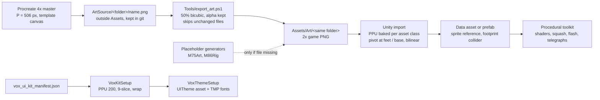

# 08. Art Pipeline

How art gets from a Procreate canvas into a Unity 6 2D URP game, and how the rules were chosen. Sources: `Docs/ART_SPEC.md`,
`Docs/ART_CHECKLIST.md`, `Docs/CREDITS.md`, `Tools/export_art.ps1`, import `.meta` files, the editor setup scripts and git history.
Items marked [VERIFY] are inferences, not confirmed in the repo.

## 1. Who did what

- **Human (solo developer):** drew all final art in Procreate (player body, four arms, backdrop, Chaser, Skirmisher, Pumpking, the VOX
  VEGETALLIS UI kit art [VERIFY: authorship of the kit; CREDITS.md calls it "project art"]), made the concept image
  (`Docs/Reference/concept_arena.png`) and the UI mockups (`Docs/Reference/UI/*.png`), playtested every scale change, and made the calls.
- **Agent (Claude Code):** wrote the export script, import-setting and pivot hook-ups, placeholder art generators, the shader graphs and
  materials, the rig test, the theme builder, and maintained the art docs. Rule in CLAUDE.md: the agent never replaces or moves the
  human's art; placeholders are only written where no file exists.

## 2. Pipeline

**Why 4x masters, 2x game PNGs.** The spec defines three tiers: master 4x (7680x4320 arena, player P = 506 px), game 2x
(3840x2160, P = 253), and what a 1080p screen shows (~127 px). Drawing once at 4x keeps source sharp for 4K and future re-exports;
shipping 2x halves texture memory, which matters for the mobile/Switch targets in CLAUDE.md. The script makes the downscale
reproducible and scripted, so nobody paints at 2x by hand ("Never paint directly at 2x once masters exist").

**Script details (`export_art.ps1`).** System.Drawing, HighQualityBicubic, `CompositingMode.SourceCopy`, 32bpp ARGB, and a
`TileFlipXY` wrap mode so edge pixels do not bleed transparent/black into borders. Mirrors folder structure
(`ArtSource/Bosses/Pumpking` -> `Assets/Art/Bosses/Pumpking`), accepts a subfolder argument and `-Force`, skips outputs newer than the master.

## 3. Unit P and sizes

Everything is expressed relative to **P = player body height** (feet to top of head), so the style could change without redoing sizes.
Examples: Chaser 0.7-0.9 P, Skirmisher ~1 P, Sentry ~1 P tall x 1.2 P wide, bosses 2.5-5 P (Pumpking ~2.7 P), arms ~0.5 P long, player
bullets 0.15-0.25 P, enemy bullets 0.2-0.3 P, pickups 0.3-0.4 P, Low walls 0.4-0.5 P, Tall pillars 1.8-2.5 P.

**How P changed.** The first spec drew masters at P = 660 (2x = 330, 1080p = 165 px). After the scale test the character scale was
locked at 1.15x, and commit `2c8407f` ("art pipeline sizes updated from P=660 to P=506") rewrote the table: master 506, export 253, screen
~127 (126.5 px at 1080p). Arithmetic check: 660 / 506 is about 1.30, so this is not simply the 1.15x factor [VERIFY: how 506 was derived;
the character is also smaller than the 1.5x trial, which explains part of it]. Existing P = 440 art is still accepted because the game
rescales through import settings; final art is to be redrawn at 506.

## 4. The 3/4 oblique rules (what the artist follows)

1. Vertical lines stay vertical (no converging walls, keeps sorting simple). Not isometric, not true perspective.
2. Floor is squashed by one ratio **F = 0.6**: circles become 1.0 x 0.6 ellipses. The same F drives trap areas, shadows, footprints,
   the arm ring (ArmRingTuning must equal F) and pickup glows.
3. Two faces visible: top (x F) and south front (full height).
4. Light from top-left; short soft shadows fall down-right.
5. Height reads as "up the screen"; a jump lifts the body, the shadow stays.

**Pivots and footprints.** Pivot = center of the footprint on the ground; Unity sorts (Custom Axis 0,1,0) by the pivot, so a wrong pivot
is a wrong overlap. Colliders are flat footprint ellipses/boxes, not the sprite. If art does not reach the template's feet line, the
pivot goes at the art's real base (Skirmisher base y~800 of 1024; Pumpking ~2016 of 2560). Evidence in metas: Skirmisher pivot
(0.513, 0.219), Pumpking (0.534, 0.212). 4 px padding, feet on the same pixel row in every frame, static objects get a separate `_shadow`
sprite, characters get code shadows (they move during jumps).

**Height classes** make gameplay readable: Flat (0), Low (<= 0.5 P, jumpable, blocks bullets), Tall (>= 1.5 P, never jumpable, fades to ~40%
when something stands behind it), Boundary. A deliberate gap between 0.5 and 1.5 P means players can tell at a glance what is hoppable;
the jump apex must lift the body >= 0.7 P. Low obstacles share a visual cue (flat top with colored cap).

## 5. Asset types, sizes, pivots, import settings

| Asset | Master / canvas | Game PNG | PPU (actual .meta) | Pivot | Notes |
|---|---|---|---|---|---|
| Player body (`Playersprite`) | P = 506, character template 1536 [VERIFY] | 302x315 tight-cropped | 273.91 (was 315, then 210 at 1.5x) | center (0.5, 0.5) | Filter bilinear; footprint/feet handled in prefab [VERIFY] |
| Arms (4 colors) | ~0.5 P, drawn pointing right | 2x | 347.83 (400 x 1.15 x 0.75) [VERIFY formula] | attach point (e.g. red 0.148, 0.746) | Muzzle offset in WeaponArmData |
| Painted enemies (Skirmisher) | character 1536, ~1 P | 2x | 191.30 (220 x 0.87) | feet/base (0.513, 0.219) | Idle only; windup is a code pulse |
| Boss (Pumpking) | boss template 2560 | 2x | 191.30 | base (0.534, 0.212) | ~2.7 P as drawn; poses fall back to idle |
| Arena backdrop (scale test) | 4x master | 2x | 220 | center | Arena kept at original scale; layered art still to draw |
| VOX UI sprites (61 PNGs) | 3x mockup px = kit px | 2x | 200 (half size on the 1080p canvas) | center | 9-slice borders from manifest; trims use Wrap = Repeat |
| Placeholders (shapes, parts, VFX dots) | generated | n/a | per generator | center | Only created if missing |

Global: PNG, transparent, sRGB, lowercase `category_name_state_##.png`, bilinear filter + compression (painted HD style; pixel art option
rejected), same canvas size for all frames of one character.

## 6. The scale test and the 1.15x lock

Procedure from spec section 9: rough sketches dropped in, hooked up by the agent with a fixed prompt (export, import settings, pivots,
footprints, ring and shadow ratio F, screenshots at 1920x1080 and phone size), then play, then "adjust P, PPU or F in this file, not the art".

History (git):
- `15b44f0` "Scale test: painted backdrop + Chaser, arena bounds, player core marker"; `c393055` letterboxed camera, arm ring and a
  character-scale test. Art in `ArtSource/ScaleTest/` (`arena01_backdrop`, `enemy_chaser_idle_side`).
- `245a1f0` C1: the temporary 1.5x was baked via PPU and data (player 315 -> 210, arms 400 -> 266.67, painted enemy 220 -> 146.67, placeholder
  enemy sizes x1.5), then the test scaffolding (`CharacterScale`, F5 key) removed; `ScaleTestArt` renamed `ArenaArt`.
- `f74d79b` Scale lock: 0.75x-1.5x playtested, **1.15x** chosen and re-baked: player 273.9, arms 347.8, painted enemy 191.3 PPU; ring, muzzles,
  jump height, footprints and nav radius re-baked alongside.
- `2c8407f` docs P660 -> P506.

Lesson: scale touches art PPU, collision footprints, arm ring, jump, nav radius and muzzles, so a runtime scale knob was useful for the
test but was deliberately removed and baked into data to avoid two sources of truth.

## 7. Layered arena art

Never one flattened image: `floor` (tileable + decals, lower contrast than anything interactive), `backwall` (stands, crowd, gates),
`sidewalls_left/right`, individual obstacle sprites (Low wall modular pieces `straight/end_left/end_right/corner`, Tall with
`_dmg0/1/2`, `_debris`, chunks), and a short `foreground` (railing, front crowd) drawn over gameplay. Animated props (torches, banners,
crowd) are separate small sprites. Fixed camera for the main arena; wider aspect ratios get extra crowd/wall art, never gameplay space.
Status: only the scale-test backdrop exists in `Assets/Art`; vertical-slice arena art is an open milestone (unchecked in CLAUDE.md).
Traps need four drawn states: idle, telegraph (reserved DANGER #FF4D33), active, cooldown.

## 8. Animation approach

Hybrid: draw 1-3 key poses, code does the motion. Player gets a 4-frame run cycle plus takeoff/land poses; enemies idle/windup/attack;
bosses the same on the 2560 template. Procedural toolkit: breathing, hop-walk bob, lean, squash/stretch, hit flash, knockback, windup
inflate + tremble + DANGER pulse, spawn pop, death dissolve. Shader graphs in `Assets/Art/Shaders`: Sprite_Character, HitFlash, Dissolve,
Outline, PulseGlow, TintPalette, UVScroll, Wave; plus Mat_SpriteCharacter / Mat_SpriteOutline and `Mat_Vfx_*` particle materials (coin,
confetti, debris, dust, smoke, spark, steam). Known wart: SRP Batcher warning on the two sprite materials, queued for M12.

**Rigging is reserved for the merchant** (bosses deferred). `M86Rig.cs` proves the path with no hand art: it writes a layered PSD with
parts named `head, torso, arm_L, arm_R, leg_L, leg_R`, imports via 2D PSD Importer (Character mode), writes skeleton and rigid weights
through sprite-editor data providers, and drives a procedural bone animation. Real Procreate PSD exports replace it later.

## 9. Placeholders, then painted art

Policy: simple colored shapes for enemies, bullets, pickups, bosses and UI, so systems are built and tuned before art exists. `M75Art.cs`
draws tiles, obstacles, HUD icons and glyphs as PNGs but writes only files that do not exist, so real art under the same name is never overwritten.

Hook-ups done: Chaser (scale test), Skirmisher (`d8e48d5`, on `Enemy_Weaver`, idle only, pivot at mushroom base, windup shown by a
visual-only pulse in the last 0.3 s), Pumpking (M10, idle only, pivot at real base, 2.7 P; windup/attack poses fall back to idle). Checklist
keeps "drawn / hooked up / pending" states, which let gameplay ship ahead of art.

## 10. Paper-doll player (CC1)

Player is swappable parts stacked on one shared canvas so nothing needs offsets: Body(1), Armor(2), Head(3), Accessory 1 head anchor(4),
Accessory 2 back anchor(5, or behind body for capes). Implemented with 2D Animation **Sprite Library + Sprite Resolver** and
`CosmeticPartData` assets (3 placeholder variants per slot; `Assets/Art/Placeholder/Parts/part_<slot>_<variant>.png`). Rules: neck and
shoulder joins identical across variants; name `player_<part>_<variant>_<facing>.png`; side facing first; HUD portrait reuses head +
accessory 1 so no extra portrait art. Cosmetics are purely visual and stored in the profile (v2).

## 11. VOX VEGETALLIS UI kit and theme

UI2 replaced the stand-in third-party pack (dobo "Mega Cozy", removed) with an in-house kit. `vox_ui_kit_manifest.json` is the single
contract: per sprite `size`, `nine_slice_border_LTRB`, notes; plus `tokens` (colors such as ink_soil #2E1F14, marble #F4EEDC, gold #E9B63A,
tomato, leaf, carrot, corn, sage; rarity colors common/rare/epic/legendary; and `reserved_never_in_ui`: the two enemy-bullet hues).
`scale_note`: all sprites are 2x game art, mockup px x3 = kit px.
- `VoxKitSetup.cs` parses the manifest (regex, no JSON library) and sets importer PPU 200 (half size on the 1080p canvas), 9-slice
  borders (manifest LTRB maps to Unity's left/bottom/right/top vector), and Repeat wrap for tileable checker trims.
- `VoxThemeSetup.cs` builds `Data/UI/VoxVegetallis.asset` from tokens and sprites, assigns it to GameConfig, sets TMP defaults and fallbacks,
  deletes the retired theme, and re-applies the theme to every prefab with themed components. Safe to re-run.
- Fonts (all SIL OFL 1.1): Cinzel Decorative (titles, logo), Lilita One (buttons, numbers), Nunito (body 600, labels 800); static TMP SDF atlases.
- Mockups in `Docs/Reference/UI` (MainMenu, Shop, Armory, HUD, Settings, CharacterCreation) served as targets.
Benefit: art changes flow through data and a rerunnable script rather than per-screen edits (ThemedImage/ThemedButton read the theme).

## 12. Credits and licensing

`Docs/CREDITS.md` lists every third-party asset with family, use, author, source and license; rule: add a row whenever a pack or font
enters the project. Font license texts sit next to the font files. Nunito static weights came from an npm package because Google ships only
a variable font that TMP cannot weight-select; this is documented. The temporary third-party UI pack was replaced before release and its
copies deleted, so no paid-pack licensing is carried.

## 13. Lessons

- Size everything in P, not pixels; it made the P660 -> P506 change a table edit.
- Bake scale into import PPU and data; remove test-time knobs once locked.
- Pivot at the art's real base, not the template line; footprints are colliders.
- Put art-to-engine rules in a manifest or script so a re-run is safe and idempotent (export script, Vox setup, placeholder guards).
- Placeholders with stable filenames let painted art arrive incrementally without code edits.
- Open items: vertical-slice arena layers, windup/attack poses, traps/obstacles art, merchant parts, Xbox/Switch/touch glyph sets.
