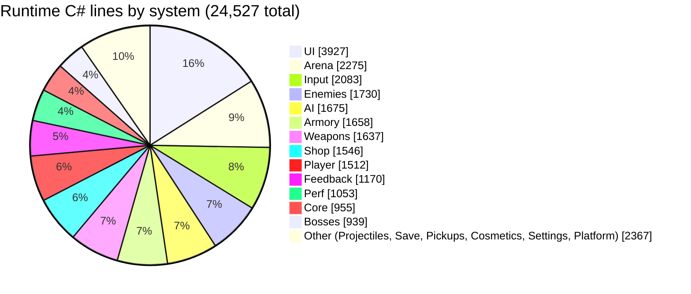
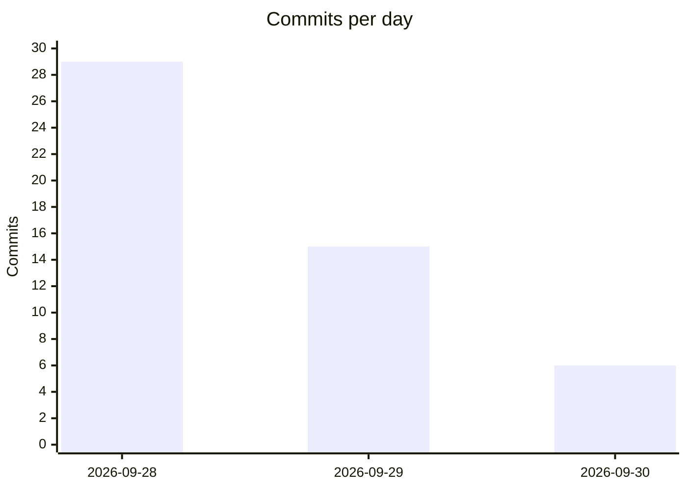

# 09 - Metrics

Numbers taken on 2026-09-30 at commit `799d55b` (working tree clean at that commit, plus the new case-study files). All figures were produced by the shell commands shown under each table (Git Bash, run from `C:\Dev\BulletHell`) so they can be re-run. Line counts are raw `wc -l` (blank lines and comments included). `.meta` files are excluded everywhere.

## 1. Code size

### Runtime C# by system (`Assets/Scripts/<folder>`)

```
for d in Assets/Scripts/*/; do f=$(find $d -name '*.cs' | wc -l); l=$(find $d -name '*.cs' -print0 | xargs -0 cat | wc -l); echo "$(basename $d) $f $l"; done
```

| System | Files | Lines |
|---|---:|---:|
| UI | 38 | 3,927 |
| Input | 6 | 2,083 |
| Arena | 19 | 2,275 |
| Enemies | 18 | 1,730 |
| AI | 15 | 1,675 |
| Weapons | 24 | 1,637 |
| Armory | 9 | 1,658 |
| Shop | 11 | 1,546 |
| Player | 15 | 1,512 |
| Feedback | 13 | 1,170 |
| Perf | 7 | 1,053 |
| Core | 15 | 955 |
| Bosses | 5 | 939 |
| Projectiles | 4 | 752 |
| Save | 6 | 467 |
| Pickups | 6 | 461 |
| Cosmetics | 5 | 335 |
| Settings | 3 | 195 |
| Platform | 2 | 157 |
| **Total runtime** | **221** | **24,527** |

(`find Assets/Scripts -name '*.cs' | wc -l` gives 221 and the same 24,527 lines; no scripts sit directly in `Assets/Scripts`.)



### Editor and tests

```
find Assets -path '*Editor*' -name '*.cs' | wc -l ; ... -print0 | xargs -0 cat | wc -l
find Assets/Tests -name '*.cs' | wc -l ; ... | xargs -0 cat | wc -l
grep -rE '^\s*\[Test\]' Assets/Tests | wc -l ; grep -rE '^\s*\[TestCase' Assets/Tests | wc -l
```

| Category | Files | Lines |
|---|---:|---:|
| Editor scripts (`Assets/Editor`, including `Assets/Editor/ShaderGen`: 32 + 2 files) | 34 | 11,259 |
| Tests (`Assets/Tests/EditMode`) | 26 | 4,991 |

Editor code is 46% of the size of runtime code: most of it is one-shot setup/builder scripts (`M4Setup` to `M9dSetup`, `Cc1Setup`, `M75Setup`, `Vox` builders) that generate scenes, prefabs and assets. [VERIFY the share of builder vs tool scripts]

### Tests

| Measure | Value |
|---|---:|
| Test files | 26 |
| `[Test]` methods | 285 |
| `[TestCase]` parameterised lines (extra cases on top of the methods) | 20 |
| `[UnityTest]` (PlayMode coroutine) | 0 |
| Known failing today (see BUGS.md, open) | 11 EditMode tests (ArenaTests 2, LayoutTests 6, PerspectiveTests 3), when run from a fresh Editor outside Play mode |

Largest test files (methods): `ArmSelectorTests` 21, `ArenaTests` 21, `M9bTests` 20, `M9aTests` 20, `M6Tests` 17, `WaveTests` 16, `LayoutTests` 16, `EnemyAiTests` 16, `FeedbackTests` 14. Smallest: `FireTimerTests` 3, `BossTests` 4, `EnemyBulletPaletteTests` 4. There are no PlayMode tests; everything is EditMode.

Test-to-runtime ratio: 4,991 / 24,527 = 0.20 lines of test per line of runtime code.

## 2. Content assets

```
for d in Assets/Data/*/; do echo "$(basename $d) $(find $d -name '*.asset' | wc -l)"; done
find Assets -name '*.asset' | wc -l ; find Assets -name '*.unity' ; find Assets -name '*.prefab' | wc -l
find Assets -name '*.shadergraph' | wc -l ; find Assets/Art -type f ! -name '*.meta' | wc -l
```

### ScriptableObject assets in `Assets/Data`

| Folder | `.asset` files |
|---|---:|
| Waves | 31 |
| Enemies | 24 |
| Arenas | 17 |
| Cosmetics | 16 |
| Armaments | 10 |
| Feedback | 9 |
| Arms | 6 |
| Effects | 6 |
| Ammo | 5 |
| Player | 3 |
| Shop | 3 |
| Bosses | 2 |
| Loadouts | 2 |
| Pickups | 2 |
| Settings | 2 |
| UI | 2 |
| Input | 1 |
| (top level of `Assets/Data`) | 1 |
| **Sum of Assets/Data** | **142** |

All `.asset` files in `Assets` (whole project, includes theme, font atlases and other non-data assets): 157. [VERIFY split of the 15 outside `Assets/Data`]

### Scenes, prefabs, shaders, art

| Item | Count |
|---|---:|
| Scenes in the build flow | 3 (`Boot`, `MainMenu`, `Game`) |
| Other scenes | 2 (`RigTest` animation test scene, `Settings/Scenes/URP2DSceneTemplate`) |
| Prefabs (all under `Assets/Prefabs`) | 23 |
| Shader Graphs | 12 |
| PNG files in `Assets` (includes third-party and UI kit) | 119 |
| Files in `Assets/Art` (non-meta) | 140 |

## 3. Commits

```
git log --format='%ad' --date=short | sort | uniq -c
git log --oneline | wc -l
git log --format='%(trailers:key=Co-Authored-By,valueonly,separator=)' | sed '/^$/d' | sort | uniq -c
```

| Day | Commits |
|---|---:|
| 2026-09-28 | 29 |
| 2026-09-29 | 15 |
| 2026-09-30 | 6 |
| **Total** | **50** |



Attribution by trailer: 5 Claude Opus 5.5, 31 Claude Sonnet 5.5, 14 untagged (details and caveats in `05_DevLog.md`).

### Commits per milestone (first-line subjects; see the DevLog for hashes)

| Milestone | Commits | Notes |
|---|---:|---|
| Setup | 2 | `c581c13`, `bececa0` |
| M0 | 3 | incl. package commit and tick; plus `8800221` controls note (counted under M1 below) |
| M1 | 5 | `8800221`, `5b356f7`, `c52770a`, `2addb41`, `6d96071` |
| M1.5 | 1 | |
| M2 | 1 (shared) | only inside `8cefcd0` [VERIFY] |
| M3a | 1 | |
| M3b | 2 | `9d5fef6`, `4b0398d` |
| M4 | 1 | |
| M5a / M5b | 1 / 2 | M5b includes design commit `921ffae` |
| M6 | 1 | |
| M7 | 2 | incl. `4bfa35d` |
| M7.5 | 1 | |
| M7.6 | 1 | |
| M7.7 | 3 | design, build, tick |
| M8 | 2 | build, tick |
| Docs refresh | 1 | `7bfb75e` |
| M8.5 | 1 | |
| M8.6 | 1 | |
| Art scale test | 5 | `c3fc59a`, `15b44f0`, `c393055`, `f366fc7`, `637d92b` |
| C1 (+ UI pack `dbd3019`) | 2 | |
| Scale lock + UI1 + CC1 (+ docs `2c8407f`) | 2 | one code commit covers three milestones |
| M9a | 1 | |
| M9b | 1 | |
| M9c | 1 | |
| M9d | 1 | |
| Pre-M10 art and docs rule | 3 | `4300774`, `fbdc702`, `d8e48d5` |
| M10 Pumpking + P1 partial | 1 | one commit covers both |
| UI2 | 1 | |
| PF1 | 0 | uncommitted |

### Largest commits by files touched

| Commit | Files | Insertions | Deletions |
|---|---:|---:|---:|
| `799d55b` UI2 | 704 | 141,624 | 41,764 |
| `dbd3019` UI pack | 332 | 24,626 | 23 |
| `f74d79b` Scale lock, UI1, CC1 | 218 | 10,753 | 2,005 |
| `64b7eee` M8.6 | 157 | 81,658 | 185 |
| `0e117c7` M5b | 127 | 4,292 | 903 |
| `ce21bf8` M7.5 | 124 | 11,510 | 932 |
| `ced81c5` M4 | 119 | 12,244 | 854 |

(From `git show --shortstat`. Insertions include generated YAML, fonts and packages, so they overstate hand-written code.)

### Span

First commit 2026-09-28 13:23, last commit 2026-09-30 14:17: about 49 hours of wall clock, with gaps overnight. M0 to M8 (skeleton to enemy AI) landed in a single day, 2026-09-28 (13:46 to 22:33).

## 4. Bugs

Sources: `Docs/BUGS.md` today and `git log -p -- Docs/BUGS.md` (7 commits touched it: `7bfb75e`, `15b44f0`, `c393055`, `64b7eee`, `a3a8740`, `1a79436`, `799d55b`).

| Counter | Value |
|---|---:|
| Entries in "Fixed" today | 10 |
| Of those: real code or asset fixes | 8 |
| Of those: closed by a design decision | 1 (phone portrait: landscape-only) |
| Of those: could not reproduce, verified working | 1 (Ricochet through low walls; it was the format example in the header) |
| Entries in "Open" today | 6 |
| Distinct bug titles ever logged (git history) | 16 (every open and fixed entry) |

Bugs closed per milestone (by the date and milestone named in each entry):

| Milestone | Fixed entries | Which |
|---|---:|---|
| Art scale test (2026-09-29) | 4 | yellow disc over the player, ArenaData bounds vs painted floor, magenta and white shapes (test pickups), backdrop framing and HUD cut-off |
| M9d (2026-09-30) | 6 | enemy bullets vs red floor, FeedbackHub quitting handler, PrimeTween warnings, Armory ring focus disc, phone portrait (design decision), Ricochet (not reproduced) |
| All other milestones | 0 logged | BUGS.md was first created in `7bfb75e` (2026-09-29, after M8); bugs found during M0 to M8 are not in BUGS.md [VERIFY] |

Bugs opened per commit: `7bfb75e` 1 (the format example), `15b44f0` 5, `c393055` 2, `64b7eee` 1, `a3a8740` 2 new (phone portrait, Armory ring) plus renames, `1a79436` 2, `799d55b` 2.

Open at the time of measurement: 6 (EditMode test failures, Destroy-from-edit-mode noise, P1 hitches, Input NullReference, SRP batching warning, UI2 mockup differences). All minor.

## 5. Documentation

```
wc -l CLAUDE.md Docs/*.md
```

| File | Lines |
|---|---:|
| `CLAUDE.md` | 497 |
| `Docs/ART_SPEC.md` | 278 |
| `Docs/ART_CHECKLIST.md` | 203 |
| `Docs/BUGS.md` | 156 |
| `Docs/CLAUDE.new.md` (draft copy of the spec) | 452 |
| `Docs/ARMAMENTS.md` | 53 |
| `Docs/CREDITS.md` | 30 |
| `Docs/ARMORY.md` | 26 |
| `Docs/SHOP.md` | 27 |
| `Docs/UI_AUDIT.md` | 20 |
| **Sum (`wc` total)** | **1,742** |

Without the `Docs/CLAUDE.new.md` draft the sum is 1,290. `Docs/CaseStudy/` is not counted (written by this task). `CLAUDE.md` was changed in 33 commits (`git log --oneline -- CLAUDE.md`) and grew from 103 lines (first commit) to 497.

Other docs: `Docs/Screenshots/` holds 8 folders (EnemyBullets, M10, M9a, M9b, M9c, M9d, UI1, VoxUI), `Docs/Reference/` holds the concept art and UI mockups.

Doc-to-code ratio: 1,742 doc lines per 24,527 runtime lines, about 7%.

## 6. Performance before/after

Baseline from P1 (partial), recorded in `Docs/BUGS.md` ("P1 hitches") and `CLAUDE.md` (P1 milestone). Test: Development build, stress test (`-perfstress`, 80 enemies, Pumpking phase 2, 8 arms firing), uncapped (`-perfvsync 0`), 1920x1080 windowed, 90 s runs analysed with `Tools/perf_analyze.ps1 -Csv <run.csv> -From 10`.

Commands (re-runnable):

```
# build a Development player to Builds/Perf, then:
BulletHell.exe -screen-width 1920 -screen-height 1080 -screen-fullscreen 0 -perfstress -perflabel X -perfseconds 90 -perfenemies 80 -perfvsync 0
# CSVs: %USERPROFILE%\AppData\LocalLow\DefaultCompany\BulletHell_Meats&Sweets\PerfLogs
powershell -File Tools/perf_analyze.ps1 -Csv <run.csv> -From 10
```

### Performance before/after (EMPTY: fill in after the P1 fixes)

| Metric | Before (baseline, 2026-09-30) | After (fill in) |
|---|---|---|
| Average fps (uncapped) | about 165 | |
| p99 frame time | about 14 ms (13.5 to 14.2 across runs) | |
| Frames over 20 ms per 80 s run | 37 (run 1), 3 to 4 (runs 2 and 3) | |
| Worst frame | 27 to 74 ms | |
| Occasional hitches | 30 to 70 ms, cause not attributed | |
| GC allocations per frame | about 180 (about 8 KB) | |
| GPU time | under 1 ms | |
| BH profiler markers (per frame) | about 1 to 3 ms (Enemy.Brain about 1.0, Nav.Separation about 0.5, Bullet.Update about 0.35, Physics2D about 0.17) | |
| Target | steady 60 fps, no visible hitches | |

Notes: this baseline is on the development PC only; no mobile or Switch numbers exist yet. `canvas_overlay_ms` in the CSV is known-bad and should be ignored. The measured runs were not repeated by this task (no build was made); the values are copied from the project docs.

## 7. Reproducing this file

```
cd /c/Dev/BulletHell
git log --reverse --format='%h|%ad|%s' --date=short
git log --format='%ad' --date=short | sort | uniq -c
find Assets/Scripts -name '*.cs' | wc -l
find Assets/Tests -name '*.cs' | wc -l
grep -rE '^\s*\[Test\]' Assets/Tests | wc -l
sed -n '/^## Open/,/^## Fixed/p' Docs/BUGS.md | grep -c '^### '
sed -n '/^## Fixed/,$p' Docs/BUGS.md | grep -c '^### '
wc -l CLAUDE.md Docs/*.md
```
